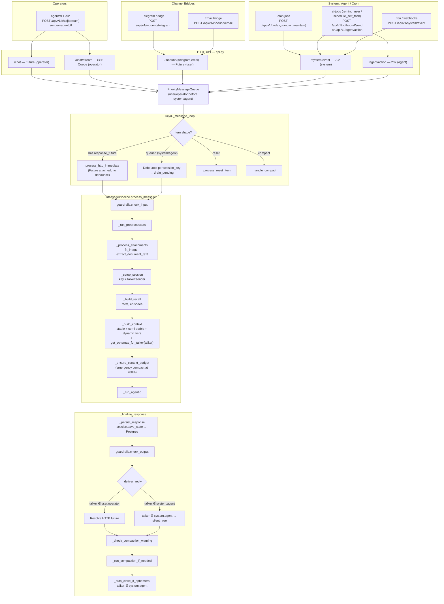
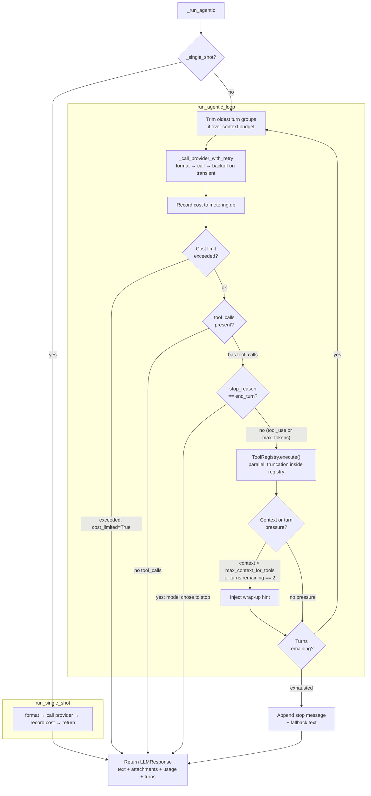
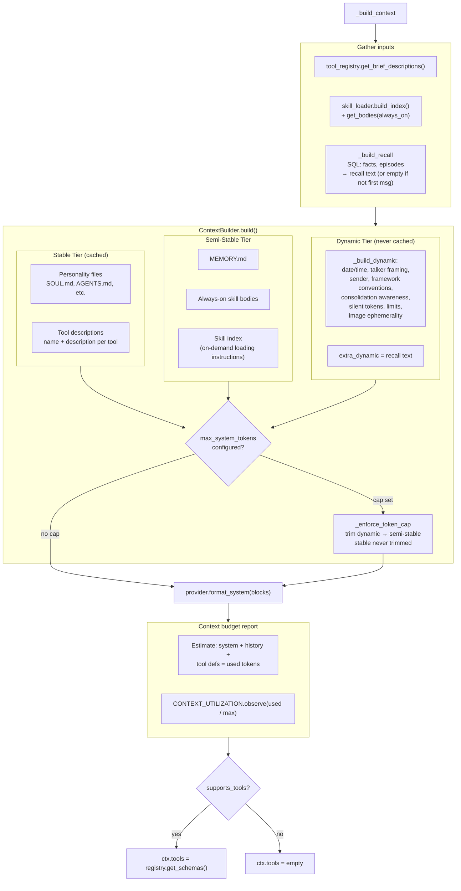
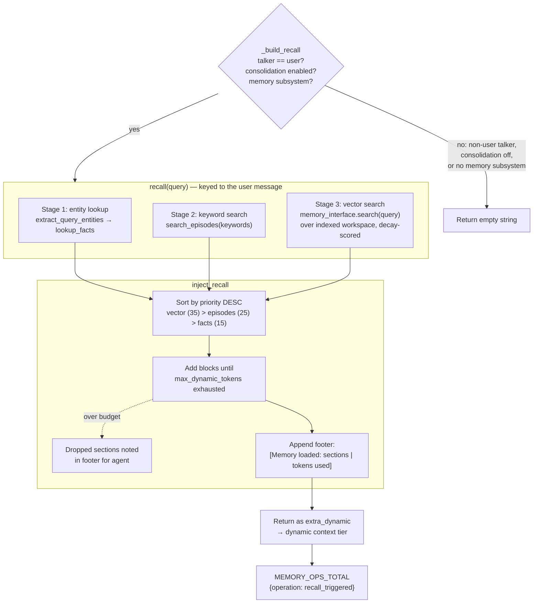
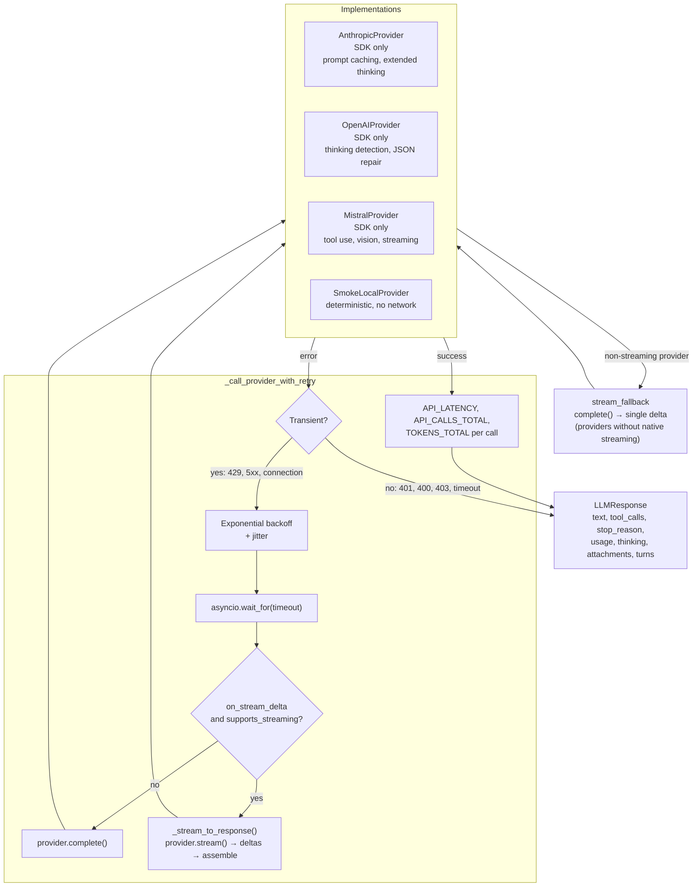
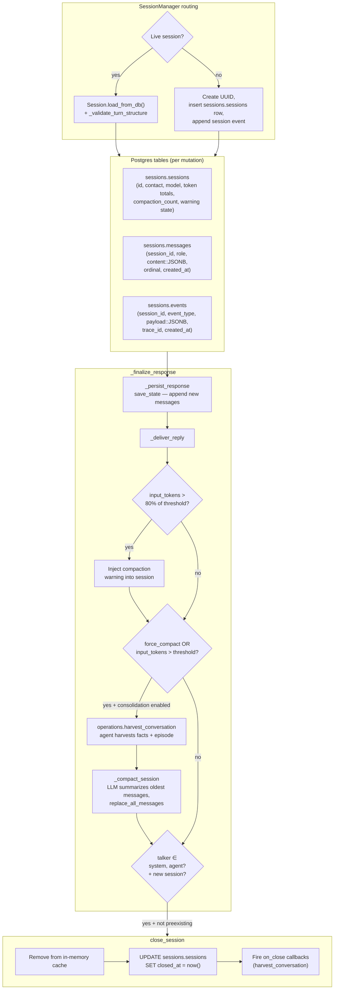
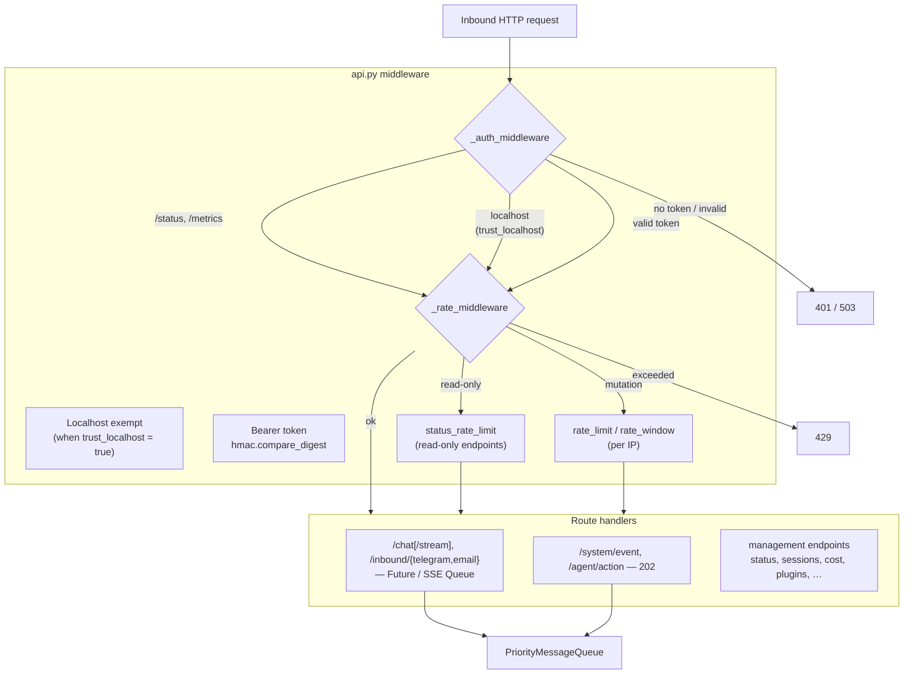
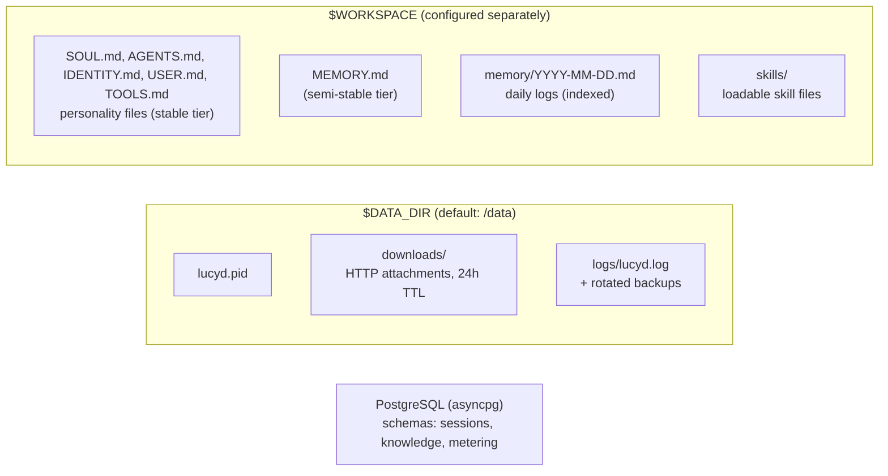
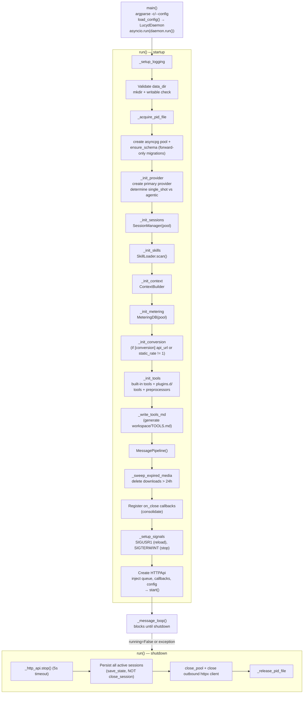

# Lucyd Architecture Diagrams

Visual reference for the Lucyd agent framework. Every diagram traces to code. Renders natively on GitHub.

The envelope is `talker:sender` — talker is pinned by the endpoint (NOT overridable from the body), sender is enumerated per talker, session key = `f"{talker}:{sender}"`. Behaviors (auto-close, memory feed, reply path) derive from talker alone. See [architecture.md](architecture.md) for the full envelope.

---

## 1. Message Lifecycle

Inbound message to response delivery. Source: `api.py` routes, `lucyd.py` `_message_loop`, `pipeline.py` `MessagePipeline.process_message`, `_finalize_response`.

### Inbound endpoints

| Endpoint | Handler | Talker | Waits | Key behavior |
|---|---|---|---|---|
| `POST /api/v1/chat` | `_handle_chat` | `operator` | Yes — `asyncio.Future` | Synchronous request/response |
| `POST /api/v1/chat/stream` | `_handle_chat_stream` | `operator` | Yes — SSE via `asyncio.Queue` | Streams deltas as SSE frames |
| `POST /api/v1/inbound/{telegram,email}` | `_handle_user_inbound` | `user` | Yes — `asyncio.Future` | Bridge inbound — talker pinned, `[user] name` injected as sender |
| `POST /api/v1/system/event` | `_handle_system_event` | `system` | No — 202 | Fire-and-forget; sender ∈ `{maintenance, automation, error}` |
| `POST /api/v1/agent/action` | `_handle_agent_action` | `agent` | No — 202 | Fire-and-forget; sender ∈ `{self, other}` |

### Callers

| Caller | Endpoint(s) used |
|---|---|
| `channels/telegram.py` | `/api/v1/inbound/telegram` |
| `channels/email.py` | `/api/v1/inbound/email` |
| agentctl + ad-hoc operators | `/api/v1/chat`, `/api/v1/chat/stream` |
| Cron (container entrypoint) | `/api/v1/{index, compact, maintain}` |
| `at` jobs (from `remind_user` / `schedule_self_task`) | `/api/v1/outbound/send` (literal) or `/api/v1/agent/action` (self-task) |
| n8n / external scripts | `/api/v1/system/event` (sender=`automation`) |


```mermaid
flowchart TD
    subgraph Bridges["Channel Bridges"]
        TG["Telegram bridge<br/>POST /api/v1/inbound/telegram"]
        EMAIL["Email bridge<br/>POST /api/v1/inbound/email"]
    end

    subgraph Operators["Operators"]
        AGENTCTL["agentctl + curl<br/>POST /api/v1/chat[/stream]<br/>sender=agentctl"]
    end

    subgraph Background["System / Agent / Cron"]
        CRON["cron jobs<br/>POST /api/v1/{index,compact,maintain}"]
        AT["at-jobs (remind_user / schedule_self_task)<br/>POST /api/v1/outbound/send<br/>or /api/v1/agent/action"]
        N8N["n8n / webhooks<br/>POST /api/v1/system/event"]
    end

    subgraph API["HTTP API — api.py"]
        CHAT["/chat — Future (operator)"]
        STREAM["/chat/stream — SSE Queue (operator)"]
        IN["/inbound/{telegram,email} — Future (user)"]
        SE["/system/event — 202 (system)"]
        AA["/agent/action — 202 (agent)"]
    end

    PQ["PriorityMessageQueue<br/>(user/operator before system/agent)"]

    subgraph Loop["lucyd._message_loop"]
        TYPE{"Item shape?"}
        IMMEDIATE["process_http_immediate<br/>(Future attached, no debounce)"]
        DEB["Debounce per session_key<br/>→ drain_pending"]
        RESET["_process_reset_item"]
        COMPACT["_handle_compact"]
    end

    subgraph Process["MessagePipeline.process_message"]
        GUARD_IN["guardrails.check_input"]
        PREPROC["_run_preprocessors"]
        ATTACH["_process_attachments<br/>fit_image, extract_document_text"]
        SETUP["_setup_session<br/>key = talker:sender"]
        RECALL["_build_recall<br/>facts, episodes"]
        BUILD["_build_context<br/>stable + semi-stable + dynamic tiers<br/>+ get_schemas_for_talker(talker)"]
        BUDGET["_ensure_context_budget<br/>(emergency compact at >80%)"]
        RUN["_run_agentic"]
    end

    subgraph Finalize["_finalize_response"]
        PERSIST["_persist_response<br/>session.save_state → Postgres"]
        GUARD_OUT["guardrails.check_output"]
        DELIVER{"_deliver_reply"}
        SYNC["Resolve HTTP future"]
        SILENT["talker ∈ system,agent → silent: true"]
        WARN["_check_compaction_warning"]
        COMPACT_RUN["_run_compaction_if_needed"]
        AUTOCLOSE["_auto_close_if_ephemeral<br/>talker ∈ system,agent"]
    end

    TG --> IN
    EMAIL --> IN
    AGENTCTL --> CHAT & STREAM
    CRON --> SE
    AT --> SE & AA
    N8N --> SE

    CHAT & STREAM & IN --> PQ
    SE & AA --> PQ
    PQ --> TYPE
    TYPE -->|"has response_future"| IMMEDIATE
    TYPE -->|"queued (system/agent)"| DEB
    TYPE -->|reset| RESET
    TYPE -->|compact| COMPACT

    IMMEDIATE --> GUARD_IN
    DEB --> GUARD_IN
    GUARD_IN --> PREPROC --> ATTACH --> SETUP --> RECALL --> BUILD --> BUDGET --> RUN
    RUN --> PERSIST --> GUARD_OUT --> DELIVER
    DELIVER -->|"talker ∈ user,operator"| SYNC --> WARN
    DELIVER -->|"talker ∈ system,agent"| SILENT --> WARN
    WARN --> COMPACT_RUN --> AUTOCLOSE
```

### Streaming branch

`/api/v1/chat` and `/api/v1/chat/stream` both attach a `response_future`. `/chat/stream` additionally attaches a `stream_queue`. The pipeline checks `stream_queue is not None` to:

1. Build `_on_stream_delta`, passed through the agentic loop to `_call_provider_with_retry`, which selects `provider.stream()` vs `provider.complete()` based on callback presence.
2. Push an error event + sentinel on agentic-loop failure to terminate the SSE stream.
3. Bridge non-streaming providers: if the provider didn't push a `done` delta, push the full reply as a single done event before the sentinel.

The processing pipeline runs identically for both paths.

### Metrics

Fire at: `_run_preprocessors` (count, duration), `_build_context` (context utilization), `_run_agentic` via agentic.py (API calls, latency, tokens, cost), tool execution (count, duration), message completion (count, duration, cost, turns), `_auto_close_if_ephemeral` (session close), `_handle_agentic_error` (errors).

---

## 2. Agentic Loop

The core thinking-acting cycle. Source: `pipeline.py` `_run_agentic()`, `agentic.py` `run_agentic_loop()`.


```mermaid
flowchart TD
    START["_run_agentic"]
    DISPATCH{"_single_shot?"}

    subgraph SingleShot["run_single_shot"]
        SS["format → call provider → record cost → return"]
    end

    subgraph ToolUse["run_agentic_loop"]
        TRIM["Trim oldest turn groups<br/>if over context budget"]
        CALL["_call_provider_with_retry<br/>format → call → backoff on transient"]
        METER["Record cost to metering.db"]
        COST_CHECK{"Cost limit<br/>exceeded?"}
        STOP{"tool_calls<br/>present?"}
        ENDTURN{"stop_reason<br/>== end_turn?"}
        TOOLS["ToolRegistry.execute()<br/>parallel, truncation inside registry"]
        PRESSURE{"Context or turn<br/>pressure?"}
        HINT["Inject wrap-up hint"]
        TURNS{"Turns<br/>remaining?"}
    end

    RETURN["Return LLMResponse<br/>text + attachments + usage + turns"]
    MAX_TURNS["Append stop message<br/>+ fallback text"]

    START --> DISPATCH
    DISPATCH -->|yes| SS --> RETURN
    DISPATCH -->|no| TRIM --> CALL --> METER --> COST_CHECK
    COST_CHECK -->|"exceeded: cost_limited=True"| RETURN
    COST_CHECK -->|ok| STOP
    STOP -->|"no tool_calls"| RETURN
    STOP -->|"has tool_calls"| ENDTURN
    ENDTURN -->|"yes: model chose to stop"| RETURN
    ENDTURN -->|"no (tool_use or max_tokens)"| TOOLS --> PRESSURE
    PRESSURE -->|"context > max_context_for_tools<br/>or turns remaining == 2"| HINT --> TURNS
    PRESSURE -->|"no pressure"| TURNS
    TURNS -->|yes| TRIM
    TURNS -->|exhausted| MAX_TURNS --> RETURN
```

### Key decision: stop vs continue

```python
if not response.tool_calls or response.stop_reason == "end_turn":
    return response
```

`end_turn` always exits — even if tool_calls are present (the model chose to stop). `max_tokens` with tool_calls *continues* to execute them: a truncated response may contain valid tool_use blocks generated before the cutoff; discarding them would corrupt the session with dangling tool_use and no tool_result.

### Truncation

Happens inside `ToolRegistry.execute()`, not as a step in the agentic loop. `_smart_truncate` applies per-tool limits: JSON arrays truncated by items, objects compacted, fallback to head+tail character cut.

### Error handling

There is no message-level retry — API-level retry inside `_call_provider_with_retry` handles transient errors. If the loop fails anyway, `_handle_agentic_error` rolls `session.messages` back to the pre-attempt snapshot (strips partial turns and the orphaned user message) and the error propagates to the caller.

---

## 3. Context Building

System prompt assembly, recall injection, and context budget. Source: `pipeline.py` `_build_context()`, `context.py` `ContextBuilder.build()`.


```mermaid
flowchart TD
    START["_build_context"]

    subgraph Inputs["Gather inputs"]
        TOOLS_DESC["tool_registry.get_brief_descriptions()"]
        SKILLS["skill_loader.build_index()<br/>+ get_bodies(always_on)"]
        RECALL["_build_recall<br/>SQL: facts, episodes<br/>→ recall text (or empty if not first msg)"]
    end

    subgraph Builder["ContextBuilder.build()"]
        subgraph Stable["Stable Tier (cached)"]
            PERSONA["Personality files<br/>SOUL.md, AGENTS.md, etc."]
            TOOL_LIST["Tool descriptions<br/>name + description per tool"]
        end

        subgraph Semi["Semi-Stable Tier"]
            MEMORY_MD["MEMORY.md"]
            SKILLS_ON["Always-on skill bodies"]
            SKILLS_IDX["Skill index<br/>(on-demand loading instructions)"]
        end

        subgraph Dynamic["Dynamic Tier (never cached)"]
            DYN_ITEMS["_build_dynamic:<br/>date/time, talker framing,<br/>sender, framework conventions,<br/>consolidation awareness,<br/>silent tokens, limits,<br/>image ephemerality"]
            RECALL_IN["extra_dynamic = recall text"]
        end

        CAP{"max_system_tokens<br/>configured?"}
        ENFORCE["_enforce_token_cap<br/>trim dynamic → semi-stable<br/>stable never trimmed"]
    end

    FORMAT["provider.format_system(blocks)"]

    subgraph Budget["Context budget report"]
        ESTIMATE["Estimate: system + history +<br/>tool defs = used tokens"]
        METRIC["CONTEXT_UTILIZATION.observe(used / max)"]
    end

    TOOL_GATE{"supports_tools?"}
    SCHEMAS["ctx.tools = registry.get_schemas()"]
    NO_TOOLS["ctx.tools = empty"]

    START --> Inputs --> Builder
    Stable --> CAP
    Semi --> CAP
    Dynamic --> CAP
    CAP -->|no cap| FORMAT
    CAP -->|cap set| ENFORCE --> FORMAT
    FORMAT --> Budget --> TOOL_GATE
    TOOL_GATE -->|yes| SCHEMAS
    TOOL_GATE -->|no| NO_TOOLS
```

### Talker framing

The dynamic tier includes session framing keyed off `talker`:

| Talker | Framing |
|---|---|
| `user` | "Messages come from the person you serve … conversation history is preserved and feeds your memory." |
| `operator` | "Messages come from an administrator (agentctl). Conversation persists for the operator session but does NOT feed user memory." |
| `system` | "Automated infrastructure events … process and reply internally — nothing is delivered to any channel, this session closes after your reply." |
| `agent` | "This message is from you (a scheduled self-action or agent-to-agent event). Execute and return — no outbound delivery, session closes after reply." |

### Recall injection

`_build_recall` fires on **every user turn** (non-user talkers, consolidation disabled, or no memory subsystem → skip). It calls `memory.recall(query)` keyed to the user's message — with the leading `[timestamp]` and any `[…saved:]` attachment prefix stripped — which retrieves facts, episodes, and vector matches over the indexed workspace. The budgeted result is passed as `extra_dynamic` into `build()` and appended to the dynamic tier.

### Token cap enforcement

When `max_system_tokens > 0`, blocks are trimmed in priority order: dynamic first, then semi-stable. Stable (persona + tool descriptions) is never trimmed. If stable alone exceeds the cap, an error is logged — persona is inviolable.

---

## 4. Per-Turn Recall

How structured memory is retrieved and injected on every user turn. Source: `pipeline.py` `_build_recall()`, `memory.py` `recall()`, `inject_recall()`.


```mermaid
flowchart TD
    GUARD{"_build_recall<br/>talker == user?<br/>consolidation enabled?<br/>memory subsystem?"}
    SKIP["Return empty string"]

    subgraph Query["recall(query) — keyed to the user message"]
        FACTS["Stage 1: entity lookup<br/>extract_query_entities → lookup_facts"]
        EPISODES["Stage 2: keyword search<br/>search_episodes(keywords)"]
        VECTOR["Stage 3: vector search<br/>memory_interface.search(query)<br/>over indexed workspace, decay-scored"]
    end

    subgraph Budget["inject_recall"]
        SORT["Sort by priority DESC<br/>vector (35) > episodes (25) > facts (15)"]
        ITER["Add blocks until<br/>max_dynamic_tokens exhausted"]
        DROP["Dropped sections noted<br/>in footer for agent"]
        FOOTER["Append footer:<br/>[Memory loaded: sections | tokens used]"]
    end

    OUTPUT["Return as extra_dynamic<br/>→ dynamic context tier"]
    METRIC["MEMORY_OPS_TOTAL<br/>{operation: recall_triggered}"]

    GUARD -->|"no: non-user talker,<br/>consolidation off,<br/>or no memory subsystem"| SKIP
    GUARD -->|yes| Query
    FACTS --> SORT
    EPISODES --> SORT
    VECTOR --> SORT
    SORT --> ITER --> FOOTER --> OUTPUT
    ITER -.->|over budget| DROP
    OUTPUT --> METRIC
```

### Preconditions

`_build_recall` runs when all of:
1. The turn's talker is `user` (operator/system/agent carry their own context)
2. `consolidation_enabled` is true in config
3. A memory subsystem exists (memory tools enabled)

The query is the user's message with the leading `[timestamp]` header and any `[…saved: /path]:` attachment prefix stripped, so retrieval keys on content. On failure, returns a fallback string directing the agent to use `memory_search` manually.

### Priority budgeting

`inject_recall` sorts blocks by priority (highest first), then iterates: each block is included if its estimated tokens fit the remaining budget. Blocks that don't fit are dropped and listed in the footer so the agent knows what's missing and can use `memory_search` to access it.

| Block | Priority | Source |
|---|---|---|
| Vector matches | 35 | `memory_interface.search(query)` over indexed workspace, exp-decay scored |
| Recent episodes | 25 | `search_episodes(keywords)` from the query |
| Known facts | 15 | `lookup_facts(entities)` from the query |

When `max_tokens` is 0, all blocks are included (unlimited budget).

### One engine, two callers

`recall()` is the single retrieval path. The pipeline calls it per user turn (above); the `memory_search` tool calls the same function for explicit lookups. Both produce the same four block types and share the priority/budget rules.

---

## 5. Provider Abstraction

Source: `providers/__init__.py` protocol + factory, `agentic.py` `_call_provider_with_retry()`.


```mermaid
flowchart TD
    subgraph Retry["_call_provider_with_retry"]
        TIMEOUT["asyncio.wait_for(timeout)"]
        STREAM_Q{"on_stream_delta<br/>and supports_streaming?"}
        COMPLETE["provider.complete()"]
        STREAM_PATH["_stream_to_response()<br/>provider.stream() → deltas → assemble"]
        METRICS["API_LATENCY, API_CALLS_TOTAL,<br/>TOKENS_TOTAL per call"]
        ERR{"Transient?"}
        BACKOFF["Exponential backoff<br/>+ jitter"]
    end

    subgraph Providers["Implementations"]
        ANTHROPIC["AnthropicProvider<br/>SDK only<br/>prompt caching, extended thinking"]
        OPENAI["OpenAIProvider<br/>SDK only<br/>thinking detection, JSON repair"]
        MISTRAL["MistralProvider<br/>SDK only<br/>tool use, vision, streaming"]
        SMOKE["SmokeLocalProvider<br/>deterministic, no network"]
    end

    FALLBACK["stream_fallback<br/>complete() → single delta<br/>(providers without native streaming)"]

    RESP["LLMResponse<br/>text, tool_calls, stop_reason,<br/>usage, thinking, attachments, turns"]

    TIMEOUT --> STREAM_Q
    STREAM_Q -->|yes| STREAM_PATH --> Providers
    STREAM_Q -->|no| COMPLETE --> Providers
    Providers -->|"non-streaming provider"| FALLBACK --> Providers
    Providers -->|success| METRICS --> RESP
    Providers -->|error| ERR
    ERR -->|"yes: 429, 5xx, connection"| BACKOFF --> TIMEOUT
    ERR -->|"no: 401, 400, 403, timeout"| RESP
```

### LLMProvider protocol

| Method | Purpose |
|---|---|
| `capabilities` | Property → `ModelCapabilities` (tools, vision, streaming, thinking, max_context_tokens) |
| `format_tools(tools)` | Generic tool schemas → provider-specific format |
| `format_system(blocks)` | Tier-tagged system blocks → provider format |
| `format_messages(messages)` | Internal messages → provider API format |
| `complete(system, messages, tools)` | Single request/response |
| `stream(system, messages, tools)` | `AsyncIterator[StreamDelta]` — yields incremental chunks |

### Streaming path

`_call_provider_with_retry` decides streaming at call time: if a `on_stream_delta` callback is provided AND `provider.capabilities.supports_streaming`, route to `_stream_to_response()`. This function consumes `provider.stream()`, forwards each delta via callback (for SSE delivery), and assembles the final `LLMResponse` from accumulated text, tool call fragments, and usage.

All providers implement `stream()`. Providers that don't natively stream (e.g. Mistral, the smoke provider) wrap `complete()` into a single `StreamDelta` via `stream_fallback` — a non-streaming shim, not a missing-SDK fallback (providers are SDK-only).

### Transient error classification

Class-name-based matching — no SDK imports required. Retryable: `RateLimitError`, `InternalServerError`, `APIConnectionError`, `OverloadedError`, plus httpx transport/timeout errors and raw `ConnectionError`/`OSError`. Non-retryable: `AuthenticationError` (401), `BadRequestError` (400), `PermissionDeniedError` (403). `TimeoutError` from `asyncio.wait_for` raises immediately, no retry.

### Factory

`create_provider(model_config, api_key)` routes by `provider` field: `"anthropic"`, `"openai"`, `"mistral"`, `"smoke-local"`. Capabilities built from model config TOML via `_build_capabilities`. Provider name set on each instance for metrics labels.

---

## 6. Session Persistence

PostgreSQL-backed storage with compaction and consolidation. Source: `session.py` `Session` + `SessionManager`, `pipeline.py` `_finalize_response`, `schema/001_initial.sql`.


```mermaid
flowchart TD
    subgraph Routing["SessionManager routing"]
        LOOKUP{"Live session?"}
        LOAD["Session.load_from_db()<br/>+ _validate_turn_structure"]
        NEW["Create UUID,<br/>insert sessions.sessions row,<br/>append session event"]
    end

    subgraph Storage["Postgres tables (per mutation)"]
        S_SESS["sessions.sessions<br/>(id, contact, model, token totals,<br/>compaction_count, warning state)"]
        S_MSG["sessions.messages<br/>(session_id, role, content::JSONB,<br/>ordinal, created_at)"]
        S_EVT["sessions.events<br/>(session_id, event_type, payload::JSONB,<br/>trace_id, created_at)"]
    end

    subgraph Finalize["_finalize_response"]
        PERSIST["_persist_response<br/>save_state — append new messages"]
        DELIVER["_deliver_reply"]
        WARN_CHECK{"input_tokens ><br/>80% of threshold?"}
        WARN["Inject compaction<br/>warning into session"]
        COMPACT_CHECK{"force_compact OR<br/>input_tokens > threshold?"}
        CONSOLIDATE["operations.harvest_conversation<br/>agent harvests facts + episode"]
        COMPACT["_compact_session<br/>LLM summarizes oldest messages,<br/>replace_all_messages"]
        AUTOCLOSE{"talker ∈<br/>system, agent?<br/>+ new session?"}
    end

    subgraph Close["close_session"]
        POP["Remove from in-memory cache"]
        MARK["UPDATE sessions.sessions<br/>SET closed_at = now()"]
        CALLBACKS["Fire on_close callbacks<br/>(harvest_conversation)"]
    end

    LOOKUP -->|yes| LOAD
    LOOKUP -->|no| NEW
    LOAD --> Storage
    NEW --> Storage
    Storage --> PERSIST --> DELIVER --> WARN_CHECK
    WARN_CHECK -->|yes| WARN --> COMPACT_CHECK
    WARN_CHECK -->|no| COMPACT_CHECK
    COMPACT_CHECK -->|"yes + consolidation enabled"| CONSOLIDATE --> COMPACT --> AUTOCLOSE
    COMPACT_CHECK -->|no| AUTOCLOSE
    AUTOCLOSE -->|"yes + not preexisting"| Close
    POP --> MARK --> CALLBACKS
```

### Session keying

Sessions are keyed by `talker:sender` (e.g., `user:Nicolas`, `operator:agentctl`, `system:maintenance`). The key is computed by the pipeline as `f"{ctx.talker}:{ctx.sender}"` and stored in `sessions.sessions.contact`.

### Storage layout

Every mutation writes to Postgres:
- **`sessions.sessions`**: one row per session. `save_state` upserts metadata (model, token totals, compaction count, warnings).
- **`sessions.messages`**: append-only via `save_state`. Ordinal-indexed; `replace_all_messages` rewrites the full set during compaction.
- **`sessions.events`**: audit trail. `append_event` writes session creation, message events, tool results, compaction.

`_validate_turn_structure` runs on load and detects orphaned `tool_calls` / `tool_result` pairs caused by interrupted agentic loops — logged + Prometheus metric, no auto-mutation.

### Compaction

Triggered in `_finalize_response` when `last_input_tokens > compaction_threshold` OR forced via `POST /api/v1/compact`. A pre-loop emergency compaction also runs in `_ensure_context_budget` if context utilization exceeds 80%. Two phases:

1. **Harvest** (if `[memory.consolidation] enabled = true`): `operations.harvest_conversation` dispatches an agentic maintenance turn in which the agent writes facts + an episode in her own voice (no neutral extractor, no auto-aliases). Must succeed before compaction — if it can't (returns `ok_to_compact = false`), compaction is skipped to avoid fact loss.
2. **Compaction**: splits messages at `keep_recent_pct` (default 33%, adaptive to 50% for ≤32k context). Boundary adjusted to avoid orphaning tool results. Old messages are summarized by the `compaction` model role. Result: `[summary_msg] + recent_messages`. Full audit trail remains in `sessions.events`.

A context warning is injected at 80% of threshold (`_check_compaction_warning`) to give the agent a chance to save important context to memory files.

### Close sequence

1. Drop session from the in-memory cache
2. Mark `sessions.sessions.closed_at = now()`
3. Fire `on_close` callbacks (consolidation extracts trailing facts + episode)

---

## 7. Tool System

Registration at startup, dispatch at runtime. Source: `tools/__init__.py` `ToolRegistry`, `lucyd.py` `_init_tools()`.


```mermaid
flowchart TD
    subgraph Startup["_init_tools"]
        REGISTRY["Create ToolRegistry<br/>truncation_limit + max_result_tokens<br/>(25% of max_context_tokens)"]
        DEPS["Build dependency dict<br/>config, provider, session_mgr,<br/>memory, conn, metering, ..."]

        subgraph Builtin["Built-in modules (LucydDaemon._TOOL_MODULES)"]
            SKIP_MOD{"Any tools in<br/>[tools] enabled?"}
            IMPORT_B["importlib.import_module"]
            CONF_B["configure(**deps) via inspect"]
            REG_B["Register each tool<br/>if name in enabled"]
        end

        subgraph Plugins["plugins.d/*.py scan"]
            HAS_EXPORTS{"Has TOOLS or<br/>PREPROCESSORS?"}
            IMPORT_P["importlib.util.spec_from_file_location"]
            CONF_P["configure(**deps) via inspect<br/>(always called)"]
            REG_T["Register TOOLS<br/>if name in enabled"]
            REG_PP["Register PREPROCESSORS<br/>(unconditional)"]
        end
    end

    subgraph Runtime["ToolRegistry.execute()"]
        CALL["Tool call from LLM"]
        LOOKUP{"In registry?"}
        NOT_FOUND["Error: tool not available<br/>+ list available tools"]
        DISPATCH{"async?"}
        AWAIT["await func(**args)"]
        SYNC["func(**args)"]
        TRUNC["_smart_truncate<br/>per-tool max_output or registry default<br/>token budget may tighten limit"]
        RESULT["{text, attachments}"]
        TYPE_ERR["Error: Invalid arguments"]
        EXEC_ERR["Error: Tool failed"]
    end

    REGISTRY --> DEPS
    DEPS --> SKIP_MOD
    SKIP_MOD -->|"no tools enabled"| SKIP_MOD
    SKIP_MOD -->|yes| IMPORT_B --> CONF_B --> REG_B
    DEPS --> HAS_EXPORTS
    HAS_EXPORTS -->|no| HAS_EXPORTS
    HAS_EXPORTS -->|yes| IMPORT_P --> CONF_P --> REG_T --> REG_PP

    CALL --> LOOKUP
    LOOKUP -->|no| NOT_FOUND
    LOOKUP -->|yes| DISPATCH
    DISPATCH -->|async| AWAIT --> TRUNC
    DISPATCH -->|sync| SYNC --> TRUNC
    TRUNC --> RESULT
    AWAIT -.->|TypeError| TYPE_ERR
    AWAIT -.->|Exception| EXEC_ERR
    SYNC -.->|TypeError| TYPE_ERR
    SYNC -.->|Exception| EXEC_ERR
```

### Gating

Built-in modules are **skipped entirely** if none of their tools appear in `[tools] enabled`. Plugin `configure()` is **always called** if the module exports TOOLS or PREPROCESSORS — only tool registration is gated by the enabled list. Preprocessors register unconditionally.

### Truncation

Two limits compete:
1. **Character limit**: per-tool `max_output` or registry-wide `truncation_limit` (default 30,000 chars)
2. **Token limit**: if `max_result_tokens > 0` (25% of model context), estimate tokens and derive a tighter char limit

`_smart_truncate` applies the lower of the two: JSON arrays truncated by items, objects compacted, fallback to head+tail character cut with a clear truncation marker.

### Metrics

Per tool call: `TOOL_CALLS_TOTAL{tool_name, status}` (success/error), `TOOL_DURATION{tool_name}` (success only).

### Built-in tools

| Tool | Module | Notes |
|------|--------|-------|
| `read`, `write`, `edit`, `send_file` | `tools/filesystem.py` | `_check_path` allowlist (`[tools.filesystem] allowed_paths`) |
| `exec` | `tools/shell.py` | Subprocess with timeout, env filtering, process group kill |
| `web_search` (Brave), `web_fetch` | `tools/web.py` | SSRF: `_is_private_ip`, DNS pin |
| `memory_search`, `memory_get` | `tools/memory_read.py` | tsvector + vector + structured recall |
| `memory_write`, `memory_forget`, `record_episode` | `tools/memory_write.py` | Writes facts and episodes |
| `sessions_spawn` | `tools/agents.py` | Sub-agent with deny-list, scoped tools |
| `session_status` | `tools/status.py` | Context utilization, uptime, cost |
| `load_skill` | `skills.py` | Markdown skill loader |
| `remind_user`, `schedule_self_task`, `list_scheduled`, `cancel_scheduled` | `tools/reminder.py` | Schedule via `at`; targets `/api/v1/outbound/send` and `/api/v1/agent/action`; list/cancel the at-spool |
| `send_message` | `tools/send_message.py` | `talkers={"agent"}` — proactive outbound + cross-session continuity |
| `gdpr_search`, `gdpr_redact` | `tools/gdpr.py` | GDPR DSR helpers |
| `pdf_read` | `tools/pdf.py` | `pypdf` text extraction with page control |

### Plugin tools (default-shipped)

| Plugin | Exports | Notes |
|--------|---------|-------|
| `plugins.d/elevenlabs.py` | TOOLS | `tts` — ElevenLabs text-to-speech (SDK + cost tracking) |
| `plugins.d/whisper.py` | PREPROCESSORS | `stt` — OpenAI Whisper / whisper.cpp transcription |
| `plugins.d/mistral_tts.py` | TOOLS | TTS via Mistral |
| `plugins.d/mistral_stt.py` | PREPROCESSORS | STT via Mistral |

---

## 8. HTTP Core + Bridge Pattern

Source: `api.py` middleware + route registration (`HTTPApi.start`), `channels/*.py`, `bridge_client.py`.

See diagram 1 for the full message lifecycle. This section covers the HTTP layer internals and bridge contract.


```mermaid
flowchart TD
    REQ["Inbound HTTP request"]

    subgraph Middleware["api.py middleware"]
        AUTH{"_auth_middleware"}
        LOCALHOST["Localhost exempt<br/>(when trust_localhost = true)"]
        TOKEN["Bearer token<br/>hmac.compare_digest"]
        RATE{"_rate_middleware"}
        RATE_RO["status_rate_limit<br/>(read-only endpoints)"]
        RATE_RW["rate_limit / rate_window<br/>(per IP)"]
    end

    subgraph Handlers["Route handlers"]
        SYNC["/chat[/stream], /inbound/{telegram,email}<br/>— Future / SSE Queue"]
        ASYNC["/system/event, /agent/action — 202"]
        MGMT["management endpoints<br/>status, sessions, cost, plugins, …"]
    end

    PQ["PriorityMessageQueue"]

    REQ --> AUTH
    AUTH -->|"/status, /metrics"| RATE
    AUTH -->|"localhost<br/>(trust_localhost)"| RATE
    AUTH -->|valid token| RATE
    AUTH -->|"no token / invalid"| REJECT["401 / 503"]
    RATE -->|ok| Handlers
    RATE -->|exceeded| REJECT429["429"]
    RATE -->|read-only| RATE_RO --> Handlers
    RATE -->|mutation| RATE_RW --> Handlers
    SYNC --> PQ
    ASYNC --> PQ
```

### Middleware

Two middleware layers, applied in order:

1. **`_auth_middleware`**: `/api/v1/status` and `/metrics` are exempt. When `[http] trust_localhost = true`, requests from `127.0.0.1` / `::1` bypass auth. Otherwise all requests require `Authorization: Bearer <token>` validated via `hmac.compare_digest` against `LUCYD_HTTP_TOKEN`. No token configured → 503.

2. **`_rate_middleware`**: per-IP rate limiting. Read-only endpoints (`/api/v1/{status, sessions, cost, monitor, index/status}` and `GET /api/v1/sessions/{id}/...`) use a separate `[http] status_rate_limit`. All other endpoints use `[http] rate_limit` / `[http] rate_window`.

### Bridge contract

Bridges are standalone processes. They don't import framework code (other than the shared `channels.bridge_outbound_server.build_outbound_app` helper). The contract:

1. Inbound: poll external source (Telegram getUpdates, IMAP), POST to `/api/v1/inbound/{telegram,email}` with `{message, attachments?}`, deliver the reply (and any attachments in the response) via the external channel.
2. Outbound: run `POST /send` listener on a conventional localhost port. The daemon calls it via `bridge_client.send_to_user` for proactive messages.

| Bridge | File | Config section | Inbound endpoint | Outbound port | Max attachment |
|--------|------|---------|---------|----|----|
| Telegram | `channels/telegram.py` | `[telegram]` in `lucyd.toml` | `POST /api/v1/inbound/telegram` | 8101 | 50 MB (Bot API cap) |
| Email | `channels/email.py` | `[email]` in `lucyd.toml` | `POST /api/v1/inbound/email` | 8102 | 20 MB (Proton cap) |

Both bridges authenticate to the daemon with `LUCYD_HTTP_TOKEN`; their outbound listeners require the same token from the daemon.

---

## 9. Data Directory Layout

Source: `config.py` `_resolve_data_dir_paths`, the container entrypoint.


```mermaid
flowchart LR
    subgraph DataDir["$DATA_DIR (default: /data)"]
        PID["lucyd.pid"]
        DOWNLOADS["downloads/<br/>HTTP attachments, 24h TTL"]
        LOGS["logs/lucyd.log<br/>+ rotated backups"]
    end

    subgraph Workspace["$WORKSPACE (configured separately)"]
        PERSONA["SOUL.md, AGENTS.md, IDENTITY.md, USER.md, TOOLS.md<br/>personality files (stable tier)"]
        MEMORY_MD["MEMORY.md<br/>(semi-stable tier)"]
        MEMORY_DIR["memory/YYYY-MM-DD.md<br/>daily logs (indexed)"]
        SKILLS["skills/<br/>loadable skill files"]
    end

    PG["PostgreSQL (asyncpg)<br/>schemas: sessions, knowledge, metering"]
```

### Path resolution

`$DATA_DIR` source priority: `LUCYD_DATA_DIR` env var > `[paths] data_dir` in TOML > `/data`. Other paths derive from it unless explicitly overridden:

| Path | Default | Source |
|------|---------|--------|
| `state_dir` | `$DATA_DIR` | `[paths] state_dir` |
| `log_file` | `$DATA_DIR/logs/lucyd.log` | `[paths] log_file` |
| `http_download_dir` | `$DATA_DIR/downloads` | `[http] download_dir` |
| `lucyd.pid` | `$state_dir/lucyd.pid` | derived from `state_dir` |

### Independently configured

- **Database** (`[database] url_env`, default env: `LUCYD_DATABASE_URL`): PostgreSQL via asyncpg with tsvector FTS + pgvector. Holds sessions, messages, events, knowledge, metering. Schema applied at startup from `schema/*.sql`.
- **Workspace** (`[agent] workspace`): personality files (stable tier), `MEMORY.md` (semi-stable), `memory/YYYY-MM-DD.md` daily logs, `skills/`. Read by `ContextBuilder`, `SkillLoader`, the indexer, and the daily diary cron (which maintains MEMORY.md's rolling diary index). Not under `$DATA_DIR`.

### Monitor state

In-memory only (`MessagePipeline._monitor_state` dict). Exposed via `GET /api/v1/monitor`. No file on disk.

---

## 10. Startup Sequence

Source: `lucyd.py` `main()`, `LucydDaemon.run()`.


```mermaid
flowchart TD
    MAIN["main()<br/>argparse -c/--config<br/>load_config() → LucydDaemon<br/>asyncio.run(daemon.run())"]

    subgraph Startup["run() — startup"]
        LOG["_setup_logging"]
        DATADIR["Validate data_dir<br/>mkdir + writable check"]
        PID["_acquire_pid_file"]
        DB["create asyncpg pool +<br/>ensure_schema (forward-only migrations)"]
        PROVIDER["_init_provider<br/>create primary provider<br/>determine single_shot vs agentic"]
        SESSION["_init_sessions<br/>SessionManager(pool)"]
        SKILLS["_init_skills<br/>SkillLoader.scan()"]
        CONTEXT["_init_context<br/>ContextBuilder"]
        METER["_init_metering<br/>MeteringDB(pool)"]
        CONV["_init_conversion<br/>(if [conversion] api_url or static_rate != 1)"]
        TOOLS["_init_tools<br/>built-in tools + plugins.d/<br/>tools + preprocessors"]
        TOOLS_MD["_write_tools_md<br/>(generate workspace/TOOLS.md)"]
        PIPE["MessagePipeline()"]
        MEDIA["_sweep_expired_media<br/>delete downloads > 24h"]
        CONSOL["Register on_close callbacks<br/>(consolidate)"]
        SIGNALS["_setup_signals<br/>SIGUSR1 (reload), SIGTERM/INT (stop)"]
        HTTP["Create HTTPApi<br/>inject queue, callbacks, config<br/>→ start()"]
    end

    RUN["_message_loop()<br/>blocks until shutdown"]

    subgraph Shutdown["run() — shutdown"]
        STOP_HTTP["_http_api.stop() (5s timeout)"]
        PERSIST["Persist all active sessions<br/>(save_state, NOT close_session)"]
        CLOSE_DB["close_pool + close outbound httpx client"]
        RELEASE["_release_pid_file"]
    end

    MAIN --> LOG --> DATADIR --> PID --> DB
    DB --> PROVIDER --> SESSION --> SKILLS --> CONTEXT --> METER --> CONV --> TOOLS
    TOOLS --> TOOLS_MD --> PIPE --> MEDIA --> CONSOL --> SIGNALS --> HTTP --> RUN
    RUN -->|"running=False or exception"| Shutdown
    STOP_HTTP --> PERSIST --> CLOSE_DB --> RELEASE
```

### Init order

Each `_init_*` depends on predecessors:

| Step | Creates | Depends on |
|------|---------|------------|
| Database pool | `self.pool` | `[database] url_env` |
| `_init_provider` | `provider`, `_providers`, `_single_shot` | config |
| `_init_sessions` | `session_mgr` | pool, config |
| `_init_skills` | `skill_loader` | config (workspace, skills_dir) |
| `_init_context` | `context_builder` | config (workspace, stable/semi-stable files) |
| `_init_metering` | `metering_db` | pool |
| `_init_conversion` | `converter` | config (only when `[conversion]` is set) |
| `_init_tools` | `tool_registry`, `_preprocessors` | provider, session_mgr, skill_loader, metering_db, converter, pool, config |
| `MessagePipeline()` | `self.pipeline` | all of the above |

`_init_tools` touches all clusters — it's the wiring step that injects dependencies into tool modules and plugins via inspect-based DI.

### Shutdown semantics

The `finally` block in `run()` persists session state via `save_state()` but does NOT call `close_session()`. Closing would trigger consolidation callbacks — wrong during shutdown. Sessions resume from Postgres on next startup via `get_or_create`.

### Signals

| Signal | Handler | Effect |
|--------|---------|--------|
| `SIGUSR1` | `handle_sigusr1` | Reload workspace files (skill_loader re-scans) |
| `SIGTERM` | `handle_sigterm` | Graceful shutdown: `running = False` → message_loop exits → cleanup |
| `SIGINT` | `handle_sigterm` | Same as SIGTERM |
