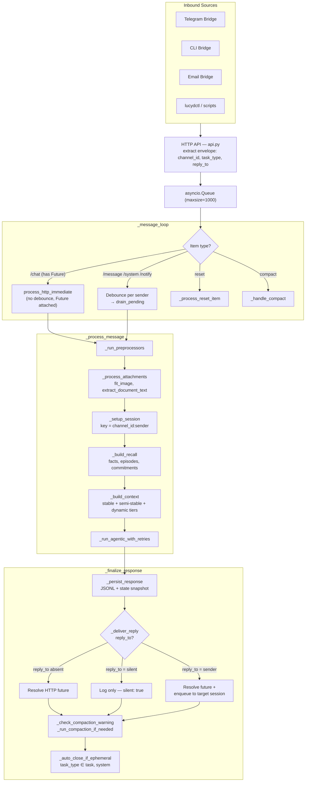
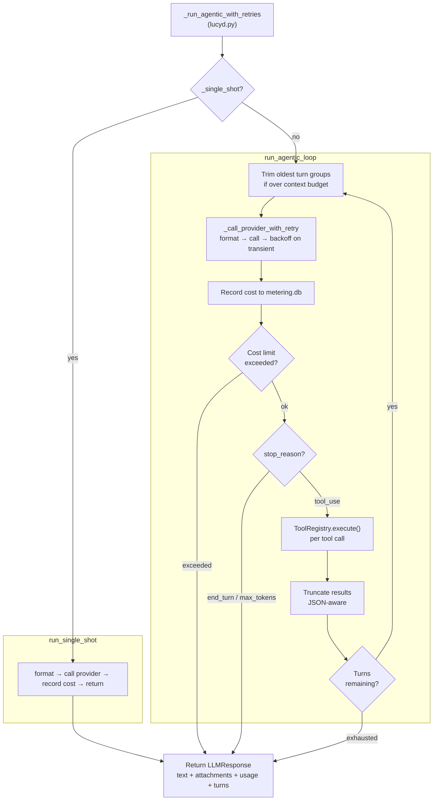
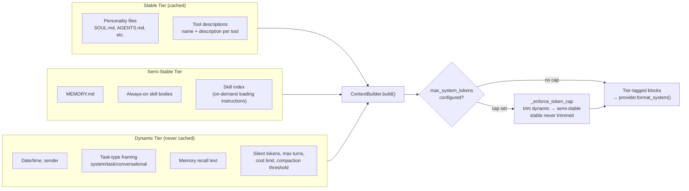
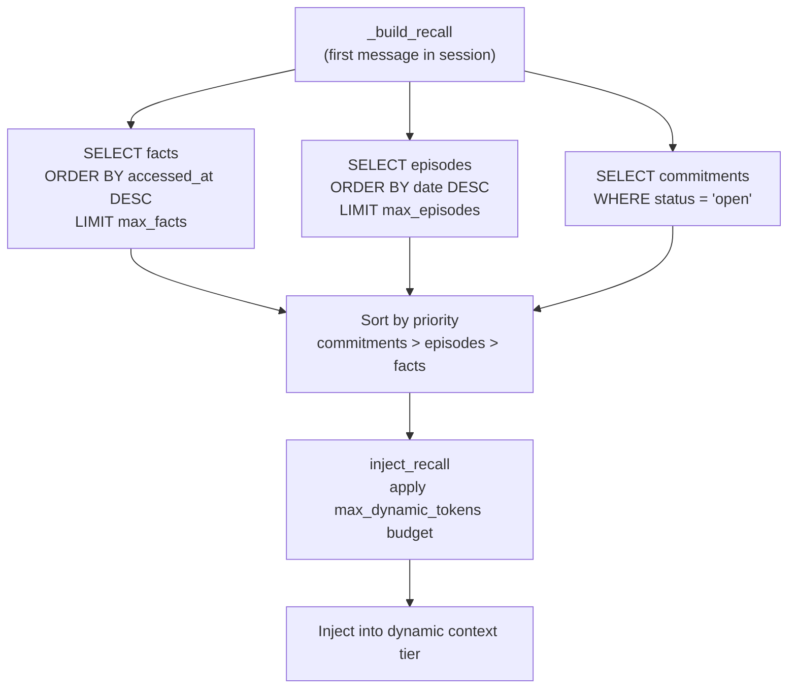
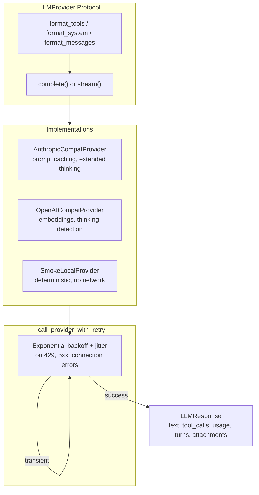
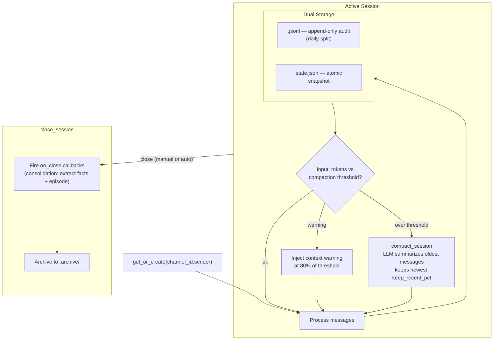
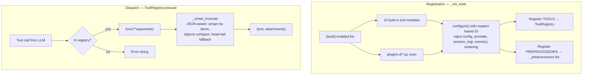
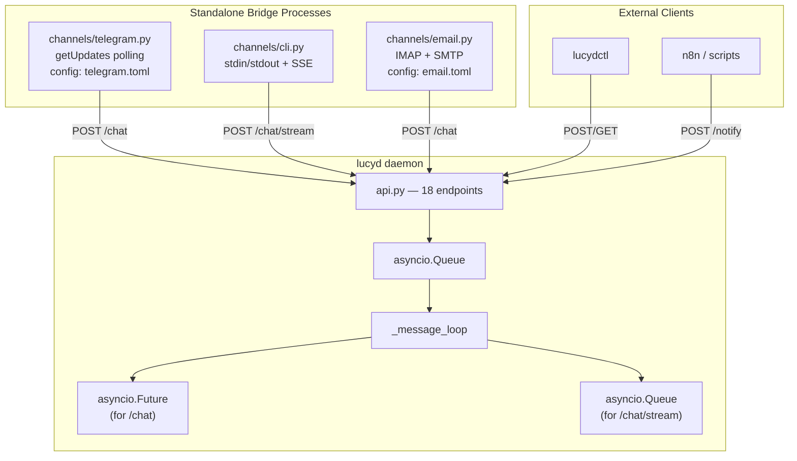
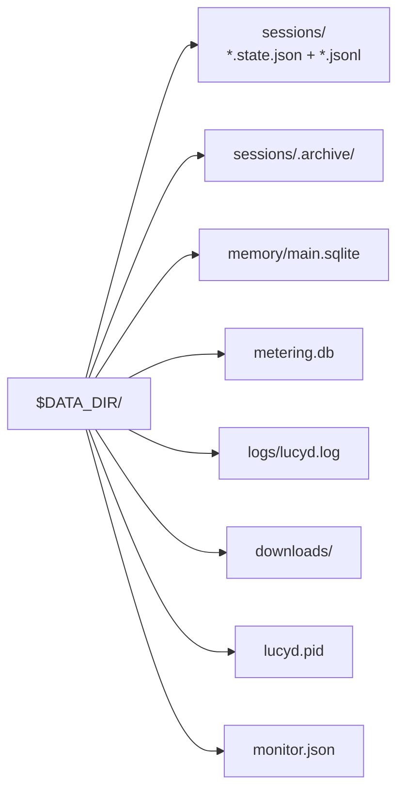
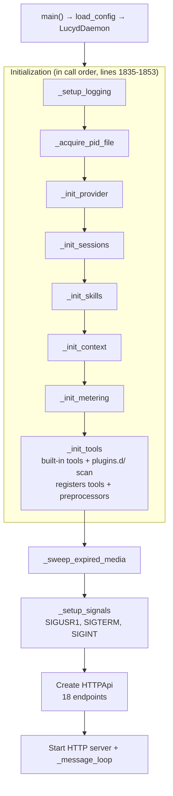

# Lucyd Architecture Diagrams

Visual reference for the Lucyd agent framework. Every diagram traces to code. Renders natively on GitHub and Gitea.

---

## 1. Message Lifecycle

Inbound message to response delivery. Source: `lucyd.py` `_message_loop`, `_process_message`, `_finalize_response`.

```mermaid
flowchart TD
    subgraph Sources["Inbound Sources"]
        TG["Telegram Bridge"]
        CLI["CLI Bridge"]
        EMAIL["Email Bridge"]
        CTL["lucydctl / scripts"]
    end

    HTTP["HTTP API — api.py<br/>extract envelope: channel_id, task_type, reply_to"]
    Q["asyncio.Queue (maxsize=1000)"]

    subgraph Loop["_message_loop"]
        TYPE{"Item type?"}
        IMMEDIATE["process_http_immediate<br/>(no debounce, Future attached)"]
        DEB["Debounce per sender<br/>→ drain_pending"]
        RESET["_process_reset_item"]
        COMPACT["_handle_compact"]
    end

    subgraph Process["_process_message"]
        PREPROC["_run_preprocessors"]
        ATTACH["_process_attachments<br/>fit_image, extract_document_text"]
        SETUP["_setup_session<br/>key = channel_id:sender"]
        RECALL["_build_recall<br/>facts, episodes, commitments"]
        BUILD["_build_context<br/>stable + semi-stable + dynamic tiers"]
        RUN["_run_agentic_with_retries"]
    end

    subgraph Finalize["_finalize_response"]
        PERSIST["_persist_response<br/>JSONL + state snapshot"]
        DELIVER{"_deliver_reply<br/>reply_to?"}
        DEFAULT["Resolve HTTP future"]
        SILENT["Log only — silent: true"]
        REDIRECT["Resolve future +<br/>enqueue to target session"]
        COMPACT_CHECK["_check_compaction_warning<br/>_run_compaction_if_needed"]
        AUTOCLOSE["_auto_close_if_ephemeral<br/>task_type ∈ task, system"]
    end

    Sources --> HTTP --> Q --> TYPE
    TYPE -->|"/chat (has Future)"| IMMEDIATE
    TYPE -->|"/message /system /notify"| DEB
    TYPE -->|reset| RESET
    TYPE -->|compact| COMPACT

    IMMEDIATE --> PREPROC
    DEB --> PREPROC
    PREPROC --> ATTACH --> SETUP --> RECALL --> BUILD --> RUN
    RUN --> PERSIST --> DELIVER
    DELIVER -->|"reply_to absent"| DEFAULT --> COMPACT_CHECK
    DELIVER -->|"reply_to = silent"| SILENT --> COMPACT_CHECK
    DELIVER -->|"reply_to = sender"| REDIRECT --> COMPACT_CHECK
    COMPACT_CHECK --> AUTOCLOSE
```

Metrics fire at: `_run_preprocessors` (count, duration), `_build_context` (context utilization), `_run_agentic_with_retries` via agentic.py (API calls, latency, tokens, cost), tool execution (count, duration), message completion (count, duration, cost, turns), `_auto_close_if_ephemeral` (session close), `_handle_agentic_error` (errors).

---

## 2. Agentic Loop

The core thinking-acting cycle. Source: `agentic.py` `run_agentic_loop` (line 253).

```mermaid
flowchart TD
    START["_run_agentic_with_retries<br/>(lucyd.py)"]
    DISPATCH{"_single_shot?"}

    subgraph SingleShot["run_single_shot"]
        SS["format → call provider → record cost → return"]
    end

    subgraph ToolUse["run_agentic_loop"]
        TRIM["Trim oldest turn groups<br/>if over context budget"]
        CALL["_call_provider_with_retry<br/>format → call → backoff on transient"]
        METER["Record cost to metering.db"]
        COST_CHECK{"Cost limit<br/>exceeded?"}
        STOP{"stop_reason?"}
        TOOLS["ToolRegistry.execute()<br/>per tool call"]
        TRUNC["Truncate results<br/>JSON-aware"]
        TURNS{"Turns<br/>remaining?"}
    end

    RETURN["Return LLMResponse<br/>text + attachments + usage + turns"]

    START --> DISPATCH
    DISPATCH -->|yes| SS --> RETURN
    DISPATCH -->|no| TRIM --> CALL --> METER --> COST_CHECK
    COST_CHECK -->|exceeded| RETURN
    COST_CHECK -->|ok| STOP
    STOP -->|end_turn / max_tokens| RETURN
    STOP -->|tool_use| TOOLS --> TRUNC --> TURNS
    TURNS -->|yes| TRIM
    TURNS -->|exhausted| RETURN
```

---

## 3. Context Building

System prompt assembly with cache tiers. Source: `context.py` `ContextBuilder.build()` (line 77).

```mermaid
flowchart LR
    subgraph Stable["Stable Tier (cached)"]
        PERSONA["Personality files<br/>SOUL.md, AGENTS.md, etc."]
        TOOL_DESC["Tool descriptions<br/>name + description per tool"]
    end

    subgraph Semi["Semi-Stable Tier"]
        MEMORY_MD["MEMORY.md"]
        SKILLS_ON["Always-on skill bodies"]
        SKILLS_IDX["Skill index<br/>(on-demand loading instructions)"]
    end

    subgraph Dynamic["Dynamic Tier (never cached)"]
        RUNTIME["Date/time, sender"]
        FRAMING["Task-type framing<br/>system/task/conversational"]
        RECALL["Memory recall text"]
        LIMITS["Silent tokens, max turns,<br/>cost limit, compaction threshold"]
    end

    BUILD["ContextBuilder.build()"]
    CAP{"max_system_tokens<br/>configured?"}
    ENFORCE["_enforce_token_cap<br/>trim dynamic → semi-stable<br/>stable never trimmed"]
    BLOCKS["Tier-tagged blocks<br/>→ provider.format_system()"]

    Stable --> BUILD
    Semi --> BUILD
    Dynamic --> BUILD
    BUILD --> CAP
    CAP -->|no cap| BLOCKS
    CAP -->|cap set| ENFORCE --> BLOCKS
```

---

## 4. Session Start Recall

How structured memory is injected at session start. Source: `memory.py` `get_session_start_context()` (line 613), called from `lucyd.py` `_build_recall` (line 757).

```mermaid
flowchart TD
    START["_build_recall<br/>(first message in session)"]

    FACTS["SELECT facts<br/>ORDER BY accessed_at DESC<br/>LIMIT max_facts"]
    EPISODES["SELECT episodes<br/>ORDER BY date DESC<br/>LIMIT max_episodes"]
    COMMITS["SELECT commitments<br/>WHERE status = 'open'"]

    PRIORITY["Sort by priority<br/>commitments > episodes > facts"]
    BUDGET["inject_recall<br/>apply max_dynamic_tokens budget"]
    OUTPUT["Inject into dynamic context tier"]

    START --> FACTS
    START --> EPISODES
    START --> COMMITS
    FACTS --> PRIORITY
    EPISODES --> PRIORITY
    COMMITS --> PRIORITY
    PRIORITY --> BUDGET --> OUTPUT
```

Note: FTS5 keyword search and vector similarity are used by the `memory_search` tool at runtime, not at session start.

---

## 5. Provider Abstraction

Source: `providers/__init__.py`, `agentic.py` `_call_provider_with_retry`.

```mermaid
flowchart TD
    subgraph Protocol["LLMProvider Protocol"]
        direction LR
        FMT["format_tools / format_system / format_messages"]
        CALL["complete() or stream()"]
    end

    subgraph Providers["Implementations"]
        ANTHROPIC["AnthropicCompatProvider<br/>prompt caching, extended thinking"]
        OPENAI["OpenAICompatProvider<br/>embeddings, thinking detection"]
        SMOKE["SmokeLocalProvider<br/>deterministic, no network"]
    end

    subgraph Retry["_call_provider_with_retry"]
        BACKOFF["Exponential backoff + jitter<br/>on 429, 5xx, connection errors"]
    end

    RESP["LLMResponse<br/>text, tool_calls, usage, turns, attachments"]

    FMT --> CALL
    CALL --> Providers
    Providers --> BACKOFF
    BACKOFF -->|transient| BACKOFF
    BACKOFF -->|success| RESP
```

---

## 6. Session Persistence

Dual storage with compaction and consolidation. Source: `session.py` `SessionManager`.

```mermaid
flowchart TD
    CREATE["get_or_create(channel_id:sender)"]

    subgraph Active["Active Session"]
        MSG["Process messages"]

        subgraph Storage["Dual Storage"]
            JSONL[".jsonl — append-only audit<br/>(daily-split)"]
            STATE[".state.json — atomic snapshot"]
        end

        CHECK{"input_tokens vs<br/>compaction threshold?"}
        WARN["Inject context warning<br/>at 80% of threshold"]
        COMPACT["compact_session<br/>LLM summarizes oldest messages<br/>keeps newest keep_recent_pct"]
    end

    subgraph Close["close_session"]
        CALLBACKS["Fire on_close callbacks<br/>(consolidation: extract facts + episode)"]
        ARCHIVE["Archive to .archive/"]
    end

    CREATE --> MSG --> Storage --> CHECK
    CHECK -->|ok| MSG
    CHECK -->|warning| WARN --> MSG
    CHECK -->|over threshold| COMPACT --> MSG
    Active -->|"close (manual or auto)"| CALLBACKS --> ARCHIVE
```

---

## 7. Tool System

Registration at startup, dispatch at runtime. Source: `tools/__init__.py`, `lucyd.py` `_init_tools` (line 454).

```mermaid
flowchart TD
    subgraph Startup["Registration — _init_tools"]
        CONFIG["[tools] enabled list"]
        BUILTIN["10 built-in tool modules"]
        PLUGINS["plugins.d/*.py scan"]
        DI["configure() with inspect-based DI<br/>inject config, provider, session_mgr, memory, metering"]
        REG_TOOLS["Register TOOLS → ToolRegistry"]
        REG_PP["Register PREPROCESSORS → _preprocessors list"]
        CONFIG --> BUILTIN --> DI
        CONFIG --> PLUGINS --> DI
        DI --> REG_TOOLS
        DI --> REG_PP
    end

    subgraph Runtime["Dispatch — ToolRegistry.execute"]
        CALL["Tool call from LLM"]
        LOOKUP{"In registry?"}
        EXEC["func(**arguments)"]
        TRUNC["_smart_truncate<br/>JSON-aware: arrays by items,<br/>objects compact, head+tail fallback"]
        RESULT["{text, attachments}"]
        ERR["Error string"]
    end

    CALL --> LOOKUP
    LOOKUP -->|yes| EXEC --> TRUNC --> RESULT
    LOOKUP -->|no| ERR
```

**Built-in tools (14):**

| Tool | Module | Async | Security |
|------|--------|-------|----------|
| `exec` | shell.py | yes | _safe_env, timeout, killpg |
| `web_search` | web.py | yes | API key gated |
| `web_fetch` | web.py | yes | SSRF: _is_private_ip, DNS pin |
| `read` | filesystem.py | no | _check_path allowlist |
| `write` | filesystem.py | no | _check_path allowlist |
| `edit` | filesystem.py | no | _check_path allowlist |
| `sessions_spawn` | agents.py | yes | deny-list, scoped tools |
| `memory_search` | memory_read.py | yes | — |
| `memory_get` | memory_read.py | yes | — |
| `memory_write` | memory_write.py | no | — |
| `memory_forget` | memory_write.py | no | — |
| `commitment_update` | memory_write.py | no | — |
| `session_status` | status.py | no | — |
| `load_skill` | skills.py | no | — |

---

## 8. HTTP Core + Bridge Pattern

Source: `api.py` route registration (lines 148-167), `channels/*.py`.

```mermaid
flowchart TD
    subgraph Bridges["Standalone Bridge Processes"]
        TG["channels/telegram.py<br/>getUpdates polling<br/>config: telegram.toml"]
        CLI["channels/cli.py<br/>stdin/stdout + SSE"]
        EMAIL["channels/email.py<br/>IMAP + SMTP<br/>config: email.toml"]
    end

    subgraph Daemon["lucyd daemon"]
        API["api.py — 18 endpoints"]
        Q["asyncio.Queue"]
        LOOP["_message_loop"]
        FUTURE["asyncio.Future<br/>(for /chat)"]
        SSE["asyncio.Queue<br/>(for /chat/stream)"]
    end

    subgraph External["External Clients"]
        CTL["lucydctl"]
        N8N["n8n / scripts"]
    end

    TG -->|"POST /chat"| API
    CLI -->|"POST /chat/stream"| API
    EMAIL -->|"POST /chat"| API
    CTL -->|"POST/GET"| API
    N8N -->|"POST /notify"| API

    API --> Q --> LOOP
    LOOP --> FUTURE
    LOOP --> SSE
```

---

## 9. Data Directory Layout

Source: `config.py` path properties, `session.py`, `metering.py`.

```mermaid
flowchart LR
    ROOT["$DATA_DIR/"]
    SESSIONS["sessions/<br/>*.state.json + *.jsonl"]
    ARCHIVE["sessions/.archive/"]
    MEMDB["memory/main.sqlite"]
    METERING["metering.db"]
    LOGS["logs/lucyd.log"]
    DOWNLOADS["downloads/"]
    PID["lucyd.pid"]
    MONITOR["monitor.json"]

    ROOT --> SESSIONS
    ROOT --> ARCHIVE
    ROOT --> MEMDB
    ROOT --> METERING
    ROOT --> LOGS
    ROOT --> DOWNLOADS
    ROOT --> PID
    ROOT --> MONITOR
```

---

## 10. Startup Sequence

Initialization order in `LucydDaemon.run()` (lucyd.py line 1837).

```mermaid
flowchart TD
    MAIN["main() → load_config → LucydDaemon"]

    subgraph Init["Initialization (in call order, lines 1835-1853)"]
        LOG["_setup_logging"]
        PID["_acquire_pid_file"]
        PROVIDER["_init_provider"]
        SESSION["_init_sessions"]
        SKILLS["_init_skills"]
        CONTEXT["_init_context"]
        METER["_init_metering"]
        TOOLS["_init_tools<br/>built-in tools + plugins.d/ scan<br/>registers tools + preprocessors"]
    end

    MEDIA["_sweep_expired_media"]
    SIGNALS["_setup_signals<br/>SIGUSR1, SIGTERM, SIGINT"]
    HTTP["Create HTTPApi<br/>18 endpoints"]
    RUN["Start HTTP server + _message_loop"]

    MAIN --> Init
    LOG --> PID --> PROVIDER --> SESSION --> SKILLS --> CONTEXT --> METER --> TOOLS
    TOOLS --> MEDIA --> SIGNALS --> HTTP --> RUN
```
