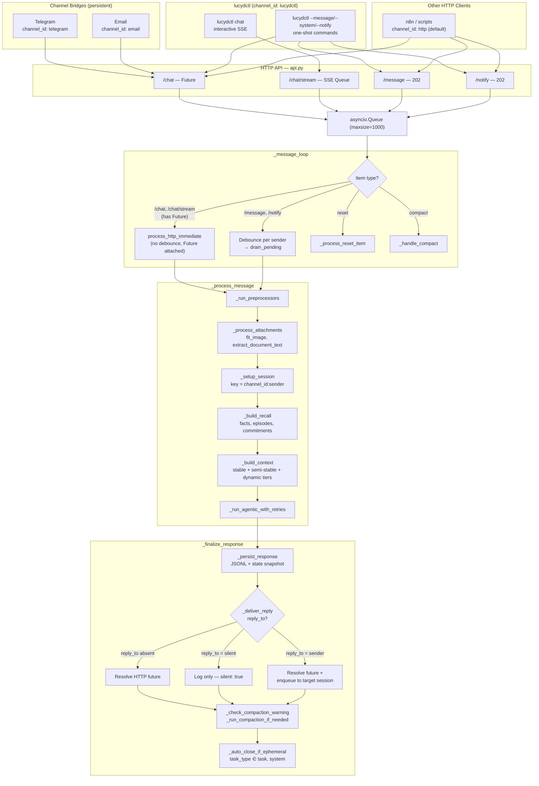
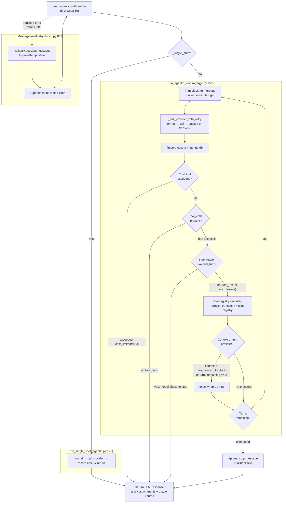
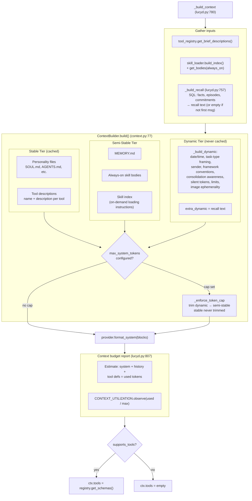
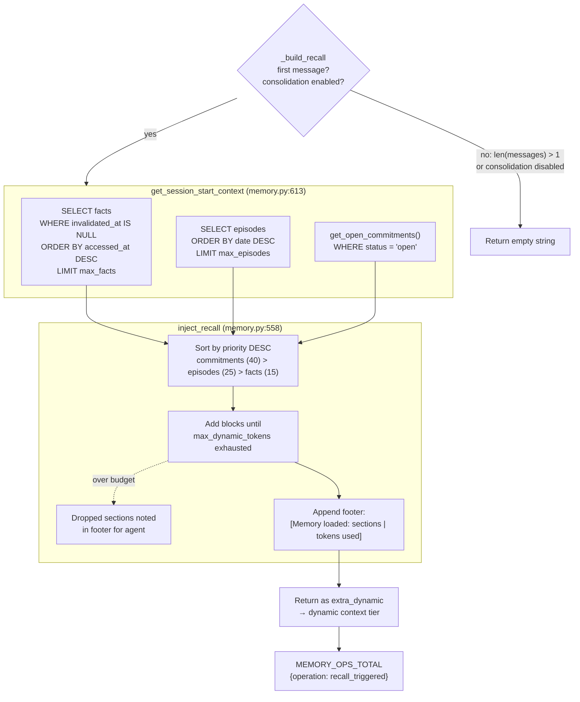
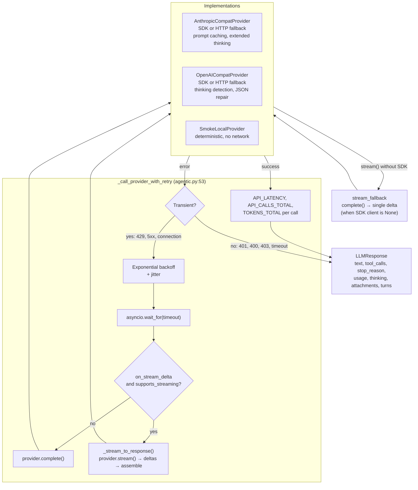
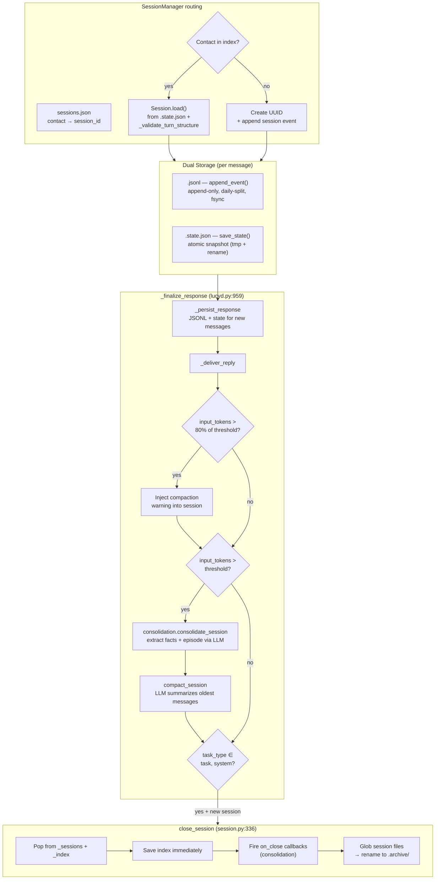
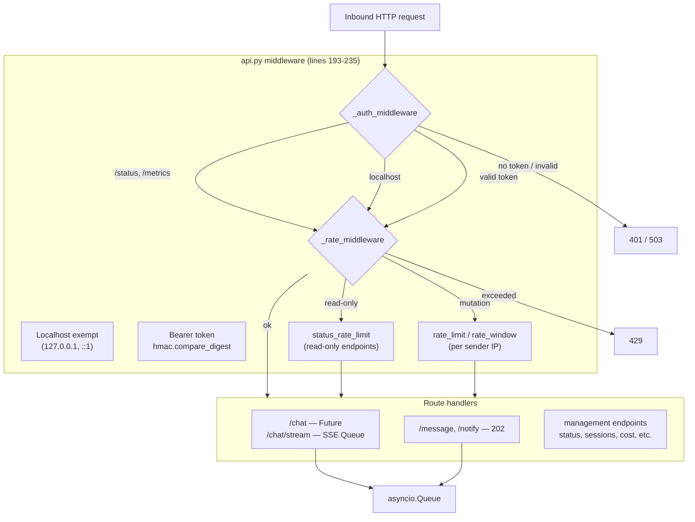
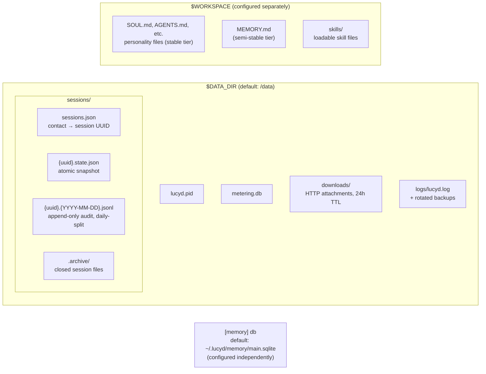
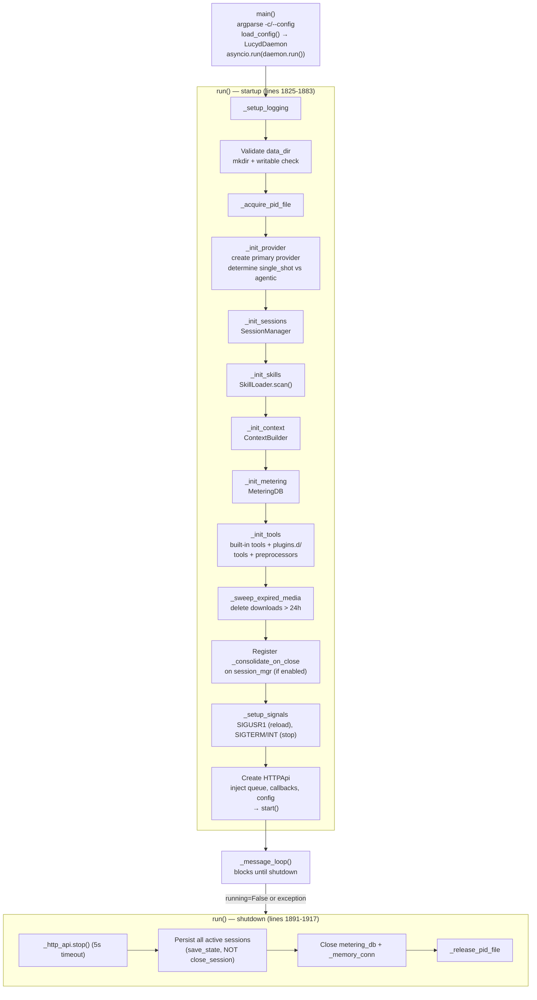

# Lucyd Architecture Diagrams

Visual reference for the Lucyd agent framework. Every diagram traces to code. Renders natively on GitHub and Gitea.

---

## 1. Message Lifecycle

Inbound message to response delivery. Source: `api.py` routes, `lucyd.py` `_message_loop`, `_process_message`, `_finalize_response`.

### Inbound endpoints

| Endpoint | Handler | Waits | Key behavior |
|---|---|---|---|
| `POST /chat` | `_handle_chat` | Yes — `asyncio.Future` | Synchronous request/response |
| `POST /chat/stream` | `_handle_chat_stream` | Yes — SSE via `asyncio.Queue` | Streams deltas as SSE frames; separate handler, separate route |
| `POST /message` | `_handle_message` | No — 202 | Fire-and-forget. When `task_type: "system"`: auto-promotes to system behavior (prefix, sender default, delivery suppressed) |
| `POST /notify` | `_handle_notify` | No — 202 | Fire-and-forget. Adds `[source]`/`[ref]` metadata. `notify` flag routes inbound message to operator session |

`POST /system` is deprecated — use `POST /message` with `task_type: "system"`.

All endpoints share `_extract_envelope()` (api.py:299): extracts `channel_id` (default `"http"`), `task_type` (validated), `reply_to` (optional).

### Callers

Bridges are persistent processes that poll an external source and POST to the daemon. `lucydctl` is the CLI tool — interactive chat (`lucydctl chat` via `/chat/stream`) and one-shot commands. Other HTTP clients get `channel_id: "http"` by default.

| Caller | channel_id | Endpoints used |
|---|---|---|
| `channels/telegram.py` | `"telegram"` | `/chat` |
| `channels/email.py` | `"email"` | `/chat` |
| `bin/lucydctl` | `"lucydctl"` | `/chat`, `/chat/stream`, `/message`, `/notify`, management |
| n8n / scripts | `"http"` (default) | any |


```mermaid
flowchart TD
    subgraph Bridges["Channel Bridges (persistent)"]
        TG["Telegram<br/>channel_id: telegram"]
        EMAIL["Email<br/>channel_id: email"]
    end

    subgraph CLI["lucydctl (channel_id: lucydctl)"]
        CHAT_MODE["lucydctl chat<br/>interactive SSE"]
        CMD["lucydctl --message/--system/--notify<br/>one-shot commands"]
    end

    subgraph Other["Other HTTP Clients"]
        N8N["n8n / scripts<br/>channel_id: http (default)"]
    end

    subgraph API["HTTP API — api.py"]
        CHAT["/chat — Future"]
        STREAM["/chat/stream — SSE Queue"]
        MSG["/message — 202"]
        NOTIFY["/notify — 202"]
    end

    Q["asyncio.Queue (maxsize=1000)"]

    subgraph Loop["_message_loop"]
        TYPE{"Item type?"}
        IMMEDIATE["process_http_immediate<br/>(no debounce, Future attached)"]
        DEB["Debounce per sender<br/>→ drain_pending"]
        RESET["_process_reset_item"]
        COMPACT["_handle_compact"]
    end

    subgraph Process["_process_message"]
        PREPROC["_run_preprocessors"]
        ATTACH["_process_attachments<br/>fit_image, extract_document_text"]
        SETUP["_setup_session<br/>key = channel_id:sender"]
        RECALL["_build_recall<br/>facts, episodes, commitments"]
        BUILD["_build_context<br/>stable + semi-stable + dynamic tiers"]
        RUN["_run_agentic_with_retries"]
    end

    subgraph Finalize["_finalize_response"]
        PERSIST["_persist_response<br/>JSONL + state snapshot"]
        DELIVER{"_deliver_reply<br/>reply_to?"}
        DEFAULT["Resolve HTTP future"]
        SILENT["Log only — silent: true"]
        REDIRECT["Resolve future +<br/>enqueue to target session"]
        COMPACT_CHECK["_check_compaction_warning<br/>_run_compaction_if_needed"]
        AUTOCLOSE["_auto_close_if_ephemeral<br/>task_type ∈ task, system"]
    end

    TG --> CHAT
    EMAIL --> CHAT
    CHAT_MODE --> STREAM
    CMD --> CHAT & MSG & NOTIFY
    N8N --> CHAT & MSG & NOTIFY

    CHAT & STREAM --> Q
    MSG & NOTIFY --> Q
    Q --> TYPE
    TYPE -->|"/chat, /chat/stream<br/>(has Future)"| IMMEDIATE
    TYPE -->|"/message, /notify"| DEB
    TYPE -->|reset| RESET
    TYPE -->|compact| COMPACT

    IMMEDIATE --> PREPROC
    DEB --> PREPROC
    PREPROC --> ATTACH --> SETUP --> RECALL --> BUILD --> RUN
    RUN --> PERSIST --> DELIVER
    DELIVER -->|"reply_to absent"| DEFAULT --> COMPACT_CHECK
    DELIVER -->|"reply_to = silent"| SILENT --> COMPACT_CHECK
    DELIVER -->|"reply_to = sender"| REDIRECT --> COMPACT_CHECK
    COMPACT_CHECK --> AUTOCLOSE
```

### Streaming branch

`/chat` and `/chat/stream` both attach a `response_future` and go through `process_http_immediate` — the queue dispatch is identical. `/chat/stream` additionally attaches a `stream_queue`. Three conditional blocks in `_process_message` check `stream_queue is not None`:

1. **Callback setup** (lucyd.py:1224): builds `_on_stream_delta`, passed through the agentic loop to `_call_provider_with_retry` (agentic.py:61), which selects `provider.stream()` vs `provider.complete()` based on callback presence.
2. **Error path** (lucyd.py:1255): pushes error event + sentinel to terminate the SSE stream.
3. **Non-streaming bridge** (lucyd.py:1267): if the provider didn't stream (no done event pushed via deltas), pushes the full reply as a single done event. Always pushes sentinel `None`.

The processing pipeline (`_run_agentic_with_retries`, `_finalize_response`) runs identically for both paths. No hidden conditional logic.

### Metrics

Fire at: `_run_preprocessors` (count, duration), `_build_context` (context utilization), `_run_agentic_with_retries` via agentic.py (API calls, latency, tokens, cost), tool execution (count, duration), message completion (count, duration, cost, turns), `_auto_close_if_ephemeral` (session close), `_handle_agentic_error` (errors).

---

## 2. Agentic Loop

The core thinking-acting cycle. Source: `lucyd.py` `_run_agentic_with_retries` (line 850), `agentic.py` `run_agentic_loop` (line 253).


```mermaid
flowchart TD
    START["_run_agentic_with_retries<br/>(lucyd.py:850)"]
    DISPATCH{"_single_shot?"}

    subgraph SingleShot["run_single_shot (agentic.py:121)"]
        SS["format → call provider → record cost → return"]
    end

    subgraph ToolUse["run_agentic_loop (agentic.py:253)"]
        TRIM["Trim oldest turn groups<br/>if over context budget"]
        CALL["_call_provider_with_retry<br/>format → call → backoff on transient"]
        METER["Record cost to metering.db"]
        COST_CHECK{"Cost limit<br/>exceeded?"}
        STOP{"tool_calls<br/>present?"}
        ENDTURN{"stop_reason<br/>== end_turn?"}
        TOOLS["ToolRegistry.execute()<br/>parallel, truncation inside registry"]
        PRESSURE{"Context or turn<br/>pressure?"}
        HINT["Inject wrap-up hint"]
        TURNS{"Turns<br/>remaining?"}
    end

    RETURN["Return LLMResponse<br/>text + attachments + usage + turns"]
    MAX_TURNS["Append stop message<br/>+ fallback text"]

    subgraph Retry["Message-level retry (lucyd.py:863)"]
        ROLLBACK["Rollback session.messages<br/>to pre-attempt state"]
        BACKOFF["Exponential backoff + jitter"]
    end

    START --> DISPATCH
    DISPATCH -->|yes| SS --> RETURN
    DISPATCH -->|no| TRIM --> CALL --> METER --> COST_CHECK
    COST_CHECK -->|"exceeded: cost_limited=True"| RETURN
    COST_CHECK -->|ok| STOP
    STOP -->|"no tool_calls"| RETURN
    STOP -->|"has tool_calls"| ENDTURN
    ENDTURN -->|"yes: model chose to stop"| RETURN
    ENDTURN -->|"no (tool_use or max_tokens)"| TOOLS --> PRESSURE
    PRESSURE -->|"context > max_context_for_tools<br/>or turns remaining == 2"| HINT --> TURNS
    PRESSURE -->|"no pressure"| TURNS
    TURNS -->|yes| TRIM
    TURNS -->|exhausted| MAX_TURNS --> RETURN

    START -.->|"transient error<br/>+ retries left"| ROLLBACK --> BACKOFF --> START
```

### Key decision: stop vs continue (agentic.py:416)

```python
if not response.tool_calls or response.stop_reason == "end_turn":
    return response
```

`end_turn` always exits — even if tool_calls are present (the model chose to stop). `max_tokens` with tool_calls *continues* to execute them: a truncated response may contain valid tool_use blocks generated before the cutoff; discarding them would corrupt the session with dangling tool_use and no tool_result.

### Truncation

Happens inside `ToolRegistry.execute()` (tools/__init__.py:208), not as a step in the agentic loop. `_smart_truncate` applies per-tool limits: JSON arrays truncated by items, objects compacted, fallback to head+tail character cut.

### Message-level retry (lucyd.py:863)

`_run_agentic_with_retries` wraps the inner loop. On transient failure with retries remaining: roll back `session.messages` to the pre-attempt snapshot (strip partial turns), sleep with exponential backoff + jitter, and re-enter. Non-transient errors or exhausted retries propagate to `_handle_agentic_error`.

---

## 3. Context Building

System prompt assembly, recall injection, and context budget. Source: `lucyd.py` `_build_context` (line 780), `context.py` `ContextBuilder.build()` (line 77).


```mermaid
flowchart TD
    START["_build_context (lucyd.py:780)"]

    subgraph Inputs["Gather inputs"]
        TOOLS_DESC["tool_registry.get_brief_descriptions()"]
        SKILLS["skill_loader.build_index()<br/>+ get_bodies(always_on)"]
        RECALL["_build_recall (lucyd.py:757)<br/>SQL: facts, episodes, commitments<br/>→ recall text (or empty if not first msg)"]
    end

    subgraph Builder["ContextBuilder.build() (context.py:77)"]
        subgraph Stable["Stable Tier (cached)"]
            PERSONA["Personality files<br/>SOUL.md, AGENTS.md, etc."]
            TOOL_LIST["Tool descriptions<br/>name + description per tool"]
        end

        subgraph Semi["Semi-Stable Tier"]
            MEMORY_MD["MEMORY.md"]
            SKILLS_ON["Always-on skill bodies"]
            SKILLS_IDX["Skill index<br/>(on-demand loading instructions)"]
        end

        subgraph Dynamic["Dynamic Tier (never cached)"]
            DYN_ITEMS["_build_dynamic:<br/>date/time, task-type framing,<br/>sender, framework conventions,<br/>consolidation awareness,<br/>silent tokens, limits,<br/>image ephemerality"]
            RECALL_IN["extra_dynamic = recall text"]
        end

        CAP{"max_system_tokens<br/>configured?"}
        ENFORCE["_enforce_token_cap<br/>trim dynamic → semi-stable<br/>stable never trimmed"]
    end

    FORMAT["provider.format_system(blocks)"]

    subgraph Budget["Context budget report (lucyd.py:807)"]
        ESTIMATE["Estimate: system + history +<br/>tool defs = used tokens"]
        METRIC["CONTEXT_UTILIZATION.observe(used / max)"]
    end

    TOOL_GATE{"supports_tools?"}
    SCHEMAS["ctx.tools = registry.get_schemas()"]
    NO_TOOLS["ctx.tools = empty"]

    START --> Inputs --> Builder
    Stable --> CAP
    Semi --> CAP
    Dynamic --> CAP
    CAP -->|no cap| FORMAT
    CAP -->|cap set| ENFORCE --> FORMAT
    FORMAT --> Budget --> TOOL_GATE
    TOOL_GATE -->|yes| SCHEMAS
    TOOL_GATE -->|no| NO_TOOLS
```

### Task-type framing (context.py:232-256)

The dynamic tier includes session framing — 4 combinations based on `task_type` and `deliver`:

| task_type + deliver | Framing |
|---|---|
| `system` + no deliver | "automated infrastructure — replies internal only" |
| `system` + deliver | "notification routed to operator" |
| `task` | "ephemeral task — session closes after reply" |
| `conversational` | "conversation — history preserved" |

### Recall injection

`_build_recall` (lucyd.py:757) only fires on the **first message** of a session (`len(session.messages) > 1` → skip). It calls `memory.get_session_start_context()` which queries structured memory: facts ordered by `accessed_at`, episodes by date, open commitments. The result is passed as `extra_dynamic` into `build()` and appended to the dynamic tier.

### Token cap enforcement (context.py:155)

When `max_system_tokens > 0`, blocks are trimmed in priority order: dynamic first, then semi-stable. Stable (persona + tool descriptions) is never trimmed. If stable alone exceeds the cap, an error is logged — persona is inviolable.

---

## 4. Session Start Recall

How structured memory is injected at session start. Source: `lucyd.py` `_build_recall` (line 757), `memory.py` `get_session_start_context()` (line 613), `inject_recall()` (line 558).


```mermaid
flowchart TD
    GUARD{"_build_recall<br/>first message?<br/>consolidation enabled?"}
    SKIP["Return empty string"]

    subgraph Query["get_session_start_context (memory.py:613)"]
        FACTS["SELECT facts<br/>WHERE invalidated_at IS NULL<br/>ORDER BY accessed_at DESC<br/>LIMIT max_facts"]
        EPISODES["SELECT episodes<br/>ORDER BY date DESC<br/>LIMIT max_episodes"]
        COMMITS["get_open_commitments()<br/>WHERE status = 'open'"]
    end

    subgraph Budget["inject_recall (memory.py:558)"]
        SORT["Sort by priority DESC<br/>commitments (40) > episodes (25) > facts (15)"]
        ITER["Add blocks until<br/>max_dynamic_tokens exhausted"]
        DROP["Dropped sections noted<br/>in footer for agent"]
        FOOTER["Append footer:<br/>[Memory loaded: sections | tokens used]"]
    end

    OUTPUT["Return as extra_dynamic<br/>→ dynamic context tier"]
    METRIC["MEMORY_OPS_TOTAL<br/>{operation: recall_triggered}"]

    GUARD -->|"no: len(messages) > 1<br/>or consolidation disabled"| SKIP
    GUARD -->|yes| Query
    FACTS --> SORT
    EPISODES --> SORT
    COMMITS --> SORT
    SORT --> ITER --> FOOTER --> OUTPUT
    ITER -.->|over budget| DROP
    OUTPUT --> METRIC
```

### Preconditions (lucyd.py:757)

`_build_recall` only fires when:
1. This is the **first message** in the session (`len(session.messages) > 1` → skip)
2. `consolidation_enabled` is true in config

On failure, returns a fallback string directing the agent to use `memory_search` manually.

### Priority budgeting (memory.py:558)

`inject_recall` sorts blocks by priority (highest first), then iterates: each block is included if its estimated tokens fit the remaining budget. Blocks that don't fit are dropped and listed in the footer so the agent knows what's missing and can use `memory_search` to access it.

| Block | Priority | Source |
|---|---|---|
| Open commitments | 40 | `commitments WHERE status = 'open'` |
| Recent episodes | 25 | `episodes ORDER BY date DESC LIMIT max_episodes` |
| Known facts | 15 | `facts WHERE invalidated_at IS NULL ORDER BY accessed_at DESC LIMIT max_facts` |

When `max_tokens` is 0, all blocks are included (unlimited budget).

### Runtime recall vs session start

FTS5 keyword search and vector similarity (`memory_search` tool) use a separate path: `_build_recall_blocks` (memory.py:486) which adds a 4th block type — vector search results (priority 35) with exponential decay scoring. Session start recall is simpler: SQL lookups only, no FTS/vector.

---

## 5. Provider Abstraction

Source: `providers/__init__.py` protocol + factory, `agentic.py` `_call_provider_with_retry` (line 53).


```mermaid
flowchart TD
    subgraph Retry["_call_provider_with_retry (agentic.py:53)"]
        TIMEOUT["asyncio.wait_for(timeout)"]
        STREAM_Q{"on_stream_delta<br/>and supports_streaming?"}
        COMPLETE["provider.complete()"]
        STREAM_PATH["_stream_to_response()<br/>provider.stream() → deltas → assemble"]
        METRICS["API_LATENCY, API_CALLS_TOTAL,<br/>TOKENS_TOTAL per call"]
        ERR{"Transient?"}
        BACKOFF["Exponential backoff<br/>+ jitter"]
    end

    subgraph Providers["Implementations"]
        ANTHROPIC["AnthropicCompatProvider<br/>SDK or HTTP fallback<br/>prompt caching, extended thinking"]
        OPENAI["OpenAICompatProvider<br/>SDK or HTTP fallback<br/>thinking detection, JSON repair"]
        SMOKE["SmokeLocalProvider<br/>deterministic, no network"]
    end

    FALLBACK["stream_fallback<br/>complete() → single delta<br/>(when SDK client is None)"]

    RESP["LLMResponse<br/>text, tool_calls, stop_reason,<br/>usage, thinking, attachments, turns"]

    TIMEOUT --> STREAM_Q
    STREAM_Q -->|yes| STREAM_PATH --> Providers
    STREAM_Q -->|no| COMPLETE --> Providers
    Providers -->|"stream() without SDK"| FALLBACK --> Providers
    Providers -->|success| METRICS --> RESP
    Providers -->|error| ERR
    ERR -->|"yes: 429, 5xx, connection"| BACKOFF --> TIMEOUT
    ERR -->|"no: 401, 400, 403, timeout"| RESP
```

### LLMProvider protocol (providers/__init__.py:132)

| Method | Purpose |
|---|---|
| `capabilities` | Property → `ModelCapabilities` (tools, vision, streaming, thinking, max_context_tokens) |
| `format_tools(tools)` | Generic tool schemas → provider-specific format |
| `format_system(blocks)` | Tier-tagged system blocks → provider format |
| `format_messages(messages)` | Internal messages → provider API format |
| `complete(system, messages, tools)` | Single request/response |
| `stream(system, messages, tools)` | `AsyncIterator[StreamDelta]` — yields incremental chunks |

### Streaming path

`_call_provider_with_retry` decides streaming at call time (agentic.py:70-73): if a `on_stream_delta` callback is provided AND `provider.capabilities.supports_streaming`, route to `_stream_to_response` (agentic.py:163). This function consumes `provider.stream()`, forwards each delta via callback (for SSE delivery), and assembles the final `LLMResponse` from accumulated text, tool call fragments, and usage.

All three providers implement `stream()` with a `stream_fallback` path: when the SDK client is `None` (no SDK installed), `stream_fallback` calls `complete()` and yields a single `StreamDelta` (providers/__init__.py:172).

### Transient error classification (agentic.py:545)

Class-name-based matching — no SDK imports required. Retryable: `RateLimitError`, `InternalServerError`, `APIConnectionError`, `OverloadedError`, plus httpx transport/timeout errors and raw `ConnectionError`/`OSError`. Non-retryable: `AuthenticationError` (401), `BadRequestError` (400), `PermissionDeniedError` (403). `TimeoutError` from `asyncio.wait_for` raises immediately, no retry.

### Factory (providers/__init__.py:203)

`create_provider(model_config, api_key)` routes by `provider` field: `"anthropic-compat"`, `"openai-compat"`, `"smoke-local"`. Capabilities built from model config TOML via `_build_capabilities`. Provider name set on each instance for metrics labels.

---

## 6. Session Persistence

Dual storage with compaction and consolidation. Source: `session.py` `Session` + `SessionManager`, `lucyd.py` `_finalize_response` (line 959).


```mermaid
flowchart TD
    subgraph Routing["SessionManager routing"]
        INDEX["sessions.json<br/>contact → session_id"]
        LOOKUP{"Contact in index?"}
        LOAD["Session.load()<br/>from .state.json +<br/>_validate_turn_structure"]
        NEW["Create UUID<br/>+ append session event"]
    end

    subgraph Storage["Dual Storage (per message)"]
        JSONL[".jsonl — append_event()<br/>append-only, daily-split, fsync"]
        STATE[".state.json — save_state()<br/>atomic snapshot (tmp + rename)"]
    end

    subgraph Finalize["_finalize_response (lucyd.py:959)"]
        PERSIST["_persist_response<br/>JSONL + state for new messages"]
        DELIVER["_deliver_reply"]
        WARN_CHECK{"input_tokens ><br/>80% of threshold?"}
        WARN["Inject compaction<br/>warning into session"]
        COMPACT_CHECK{"input_tokens ><br/>threshold?"}
        CONSOLIDATE["consolidation.consolidate_session<br/>extract facts + episode via LLM"]
        COMPACT["compact_session<br/>LLM summarizes oldest messages"]
        AUTOCLOSE{"task_type ∈<br/>task, system?"}
    end

    subgraph Close["close_session (session.py:336)"]
        POP["Pop from _sessions + _index"]
        SAVE_IDX["Save index immediately"]
        CALLBACKS["Fire on_close callbacks<br/>(consolidation)"]
        ARCHIVE["Glob session files<br/>→ rename to .archive/"]
    end

    LOOKUP -->|yes| LOAD
    LOOKUP -->|no| NEW
    LOAD --> Storage
    NEW --> Storage
    Storage --> PERSIST --> DELIVER --> WARN_CHECK
    WARN_CHECK -->|yes| WARN --> COMPACT_CHECK
    WARN_CHECK -->|no| COMPACT_CHECK
    COMPACT_CHECK -->|yes| CONSOLIDATE --> COMPACT --> AUTOCLOSE
    COMPACT_CHECK -->|no| AUTOCLOSE
    AUTOCLOSE -->|"yes + new session"| Close
    POP --> SAVE_IDX --> CALLBACKS --> ARCHIVE
```

### Session keying

Sessions are keyed by `channel_id:sender` (e.g., `telegram:Nicolas`, `lucydctl:cli`). The key is computed in `_process_message` as `f"{channel_id}:{sender}"` and passed to `get_or_create`. `sessions.json` maps these keys to session UUIDs.

### Dual storage

Every mutation writes to both stores:
- **JSONL** (`{id}.{YYYY-MM-DD}.jsonl`): `append_event()` with `fsync`. Events: session creation, user messages, assistant messages, tool results, compaction. Daily-split for rotation.
- **State** (`{id}.state.json`): `save_state()` via `_atomic_write` (temp + rename). Full snapshot: messages, token counts, compaction count, warning state.

On load, `_validate_turn_structure` (session.py:41) fixes orphaned tool_calls (no matching tool_results) and orphaned tool_results (no preceding tool_calls) — data integrity after crashes or interrupted agentic loops.

### Compaction (session.py:375)

Triggered in `_finalize_response` when `last_input_tokens > compaction_threshold`. Two phases:

1. **Consolidation** (if enabled): `consolidation.consolidate_session` extracts facts + episode summary via LLM and writes them to structured memory. Runs before compaction so the data is preserved.
2. **Compaction**: splits messages at `keep_recent_pct` (default 33%). Boundary adjusted to avoid orphaning `tool_results`. Old messages are summarized by LLM. Result: `[summary_msg, compaction_marker] + recent_messages`. Usage stats invalidated on remaining messages (accurate stats resume on next API call).

A context warning is injected at 80% of threshold (`_check_compaction_warning`) to give the agent a chance to save important context to memory files.

### Close sequence (session.py:336)

1. Pop session from in-memory `_sessions` dict
2. Pop contact from `_index`
3. **Save index immediately** — session disappears from `--sessions` before slow callbacks
4. Fire `on_close` callbacks (consolidation extracts facts + episode)
5. Archive: glob `{session_id}*` → rename to `.archive/`

---

## 7. Tool System

Registration at startup, dispatch at runtime. Source: `tools/__init__.py` `ToolRegistry`, `lucyd.py` `_init_tools` (line 454).


```mermaid
flowchart TD
    subgraph Startup["_init_tools (lucyd.py:454)"]
        REGISTRY["Create ToolRegistry<br/>truncation_limit + max_result_tokens<br/>(25% of max_context_tokens)"]
        DEPS["Build dependency dict<br/>config, provider, session_mgr,<br/>memory, conn, metering, ..."]

        subgraph Builtin["Built-in (8 modules, 14 tools)"]
            SKIP_MOD{"Any tools in<br/>[tools] enabled?"}
            IMPORT_B["importlib.import_module"]
            CONF_B["configure(**deps) via inspect"]
            REG_B["Register each tool<br/>if name in enabled"]
        end

        subgraph Plugins["plugins.d/*.py scan"]
            HAS_EXPORTS{"Has TOOLS or<br/>PREPROCESSORS?"}
            IMPORT_P["importlib.util.spec_from_file_location"]
            CONF_P["configure(**deps) via inspect<br/>(always called)"]
            REG_T["Register TOOLS<br/>if name in enabled"]
            REG_PP["Register PREPROCESSORS<br/>(unconditional)"]
        end
    end

    subgraph Runtime["ToolRegistry.execute (tools/__init__.py:144)"]
        CALL["Tool call from LLM"]
        LOOKUP{"In registry?"}
        NOT_FOUND["Error: tool not available<br/>+ list available tools"]
        DISPATCH{"async?"}
        AWAIT["await func(**args)"]
        SYNC["func(**args)"]
        TRUNC["_smart_truncate<br/>per-tool max_output or registry default<br/>token budget may tighten limit"]
        RESULT["{text, attachments}"]
        TYPE_ERR["Error: Invalid arguments"]
        EXEC_ERR["Error: Tool failed"]
    end

    REGISTRY --> DEPS
    DEPS --> SKIP_MOD
    SKIP_MOD -->|"no tools enabled"| SKIP_MOD
    SKIP_MOD -->|yes| IMPORT_B --> CONF_B --> REG_B
    DEPS --> HAS_EXPORTS
    HAS_EXPORTS -->|no| HAS_EXPORTS
    HAS_EXPORTS -->|yes| IMPORT_P --> CONF_P --> REG_T --> REG_PP

    CALL --> LOOKUP
    LOOKUP -->|no| NOT_FOUND
    LOOKUP -->|yes| DISPATCH
    DISPATCH -->|async| AWAIT --> TRUNC
    DISPATCH -->|sync| SYNC --> TRUNC
    TRUNC --> RESULT
    AWAIT -.->|TypeError| TYPE_ERR
    AWAIT -.->|Exception| EXEC_ERR
    SYNC -.->|TypeError| TYPE_ERR
    SYNC -.->|Exception| EXEC_ERR
```

### Gating

Built-in modules are **skipped entirely** if none of their tools appear in `[tools] enabled` (lucyd.py:536). Plugin `configure()` is **always called** if the module exports TOOLS or PREPROCESSORS — only tool registration is gated by the enabled list. Preprocessors register unconditionally.

### Truncation (tools/__init__.py:199-208)

Two limits compete:
1. **Character limit**: per-tool `max_output` or registry-wide `truncation_limit` (default 30,000 chars)
2. **Token limit**: if `max_result_tokens > 0` (25% of model context), estimate tokens and derive a tighter char limit

`_smart_truncate` applies the lower of the two: JSON arrays truncated by items, objects compacted, fallback to head+tail character cut with a clear truncation marker.

### Metrics

Per tool call: `TOOL_CALLS_TOTAL{tool_name, status}` (success/error), `TOOL_DURATION{tool_name}` (success only).

### Built-in tools (8 modules, 14 tools)

| Tool | Module | Async | Security |
|------|--------|-------|----------|
| `read` | filesystem.py | no | `_check_path` allowlist |
| `write` | filesystem.py | no | `_check_path` allowlist |
| `edit` | filesystem.py | no | `_check_path` allowlist |
| `exec` | shell.py | yes | `_safe_env`, timeout, `killpg` |
| `web_search` | web.py | yes | API key gated |
| `web_fetch` | web.py | yes | SSRF: `_is_private_ip`, DNS pin |
| `memory_search` | memory_read.py | yes | — |
| `memory_get` | memory_read.py | yes | — |
| `memory_write` | memory_write.py | no | — |
| `memory_forget` | memory_write.py | no | — |
| `commitment_update` | memory_write.py | no | — |
| `sessions_spawn` | agents.py | yes | deny-list, scoped tools |
| `session_status` | status.py | no | — |
| `load_skill` | skills.py | no | — |

### Plugin tools

| Plugin | Exports | Example |
|--------|---------|---------|
| `plugins.d/tts.py` | TOOLS (1) | `tts` — ElevenLabs text-to-speech |
| `plugins.d/stt.py` | PREPROCESSORS (1) | `stt` — audio transcription before agentic loop |

---

## 8. HTTP Core + Bridge Pattern

Source: `api.py` middleware + route registration (lines 145-167), `channels/*.py`, `bin/lucydctl`.

See diagram 1 for the full message lifecycle including caller → endpoint → queue → processing flow. This section covers the HTTP layer internals and bridge contract.


```mermaid
flowchart TD
    REQ["Inbound HTTP request"]

    subgraph Middleware["api.py middleware (lines 193-235)"]
        AUTH{"_auth_middleware"}
        LOCALHOST["Localhost exempt<br/>(127.0.0.1, ::1)"]
        TOKEN["Bearer token<br/>hmac.compare_digest"]
        RATE{"_rate_middleware"}
        RATE_RO["status_rate_limit<br/>(read-only endpoints)"]
        RATE_RW["rate_limit / rate_window<br/>(per sender IP)"]
    end

    subgraph Handlers["Route handlers"]
        SYNC["/chat — Future<br/>/chat/stream — SSE Queue"]
        ASYNC["/message, /notify — 202"]
        MGMT["management endpoints<br/>status, sessions, cost, etc."]
    end

    Q["asyncio.Queue"]

    REQ --> AUTH
    AUTH -->|"/status, /metrics"| RATE
    AUTH -->|localhost| RATE
    AUTH -->|valid token| RATE
    AUTH -->|"no token / invalid"| REJECT["401 / 503"]
    RATE -->|ok| Handlers
    RATE -->|exceeded| REJECT429["429"]
    RATE -->|read-only| RATE_RO --> Handlers
    RATE -->|mutation| RATE_RW --> Handlers
    SYNC --> Q
    ASYNC --> Q
```

### Middleware

Two middleware layers, applied in order:

1. **`_auth_middleware`** (api.py:193): `/status` and `/metrics` are exempt. Localhost (`127.0.0.1`, `::1`) is trusted. All other requests require `Authorization: Bearer <token>` validated via `hmac.compare_digest` against `LUCYD_HTTP_TOKEN`. No token configured → 503.

2. **`_rate_middleware`** (api.py:222): per-IP rate limiting. Read-only endpoints (`/status`, `/metrics`, `/sessions`, `GET /sessions/{id}/history`) use a separate `status_rate_limit`. All other endpoints use `rate_limit` / `rate_window`. Stale entries evicted above `rate_limit_cleanup_threshold`.

### Bridge contract

Bridges are standalone processes. They don't import framework code. The contract:

1. Poll external source (Telegram getUpdates, IMAP, stdin)
2. POST to daemon HTTP API with message envelope (`message`, `sender`, `channel_id`, optional `task_type`, `reply_to`, `attachments`)
3. Receive reply in HTTP response (for `/chat`) or SSE stream (for `/chat/stream`)
4. Deliver reply via external source (Telegram sendMessage, SMTP, stdout)

No outbound push from daemon to bridges.

| Bridge | File | channel_id | Config | Auth |
|--------|------|------------|--------|------|
| Telegram | `channels/telegram.py` | `"telegram"` | `telegram.toml` | Bearer token from `[daemon] token_env` |
| Email | `channels/email.py` | `"email"` | `email.toml` | Bearer token from `[daemon] token_env` |
| lucydctl | `bin/lucydctl` | `"lucydctl"` | env vars only | Bearer token from `LUCYD_HTTP_TOKEN` |

---

## 9. Data Directory Layout

Source: `config.py` `_resolve_data_dir_paths()` (line 301), `session.py`, `metering.py`.


```mermaid
flowchart LR
    subgraph DataDir["$DATA_DIR (default: /data)"]
        PID["lucyd.pid"]
        METERING["metering.db"]
        DOWNLOADS["downloads/<br/>HTTP attachments, 24h TTL"]
        LOGS["logs/lucyd.log<br/>+ rotated backups"]
        subgraph Sessions["sessions/"]
            INDEX["sessions.json<br/>contact → session UUID"]
            STATE["{uuid}.state.json<br/>atomic snapshot"]
            JSONL["{uuid}.{YYYY-MM-DD}.jsonl<br/>append-only audit, daily-split"]
            ARCHIVE[".archive/<br/>closed session files"]
        end
    end

    subgraph Workspace["$WORKSPACE (configured separately)"]
        PERSONA["SOUL.md, AGENTS.md, etc.<br/>personality files (stable tier)"]
        MEMORY_MD["MEMORY.md<br/>(semi-stable tier)"]
        SKILLS["skills/<br/>loadable skill files"]
    end

    MEMDB["[memory] db<br/>default: ~/.lucyd/memory/main.sqlite<br/>(configured independently)"]
```

### Path resolution (config.py:301)

`$DATA_DIR` source priority: `LUCYD_DATA_DIR` env var > `[paths] data_dir` in TOML > `/data`. All runtime paths derive from it unless explicitly overridden:

| Path | Default | Source |
|------|---------|--------|
| `state_dir` | `$DATA_DIR` | `[paths] state_dir` |
| `sessions_dir` | `$DATA_DIR/sessions` | `[paths] sessions_dir` |
| `metering_db` | `$DATA_DIR/metering.db` | `[paths] metering_db` |
| `log_file` | `$DATA_DIR/logs/lucyd.log` | `[paths] log_file` |
| `http_download_dir` | `$DATA_DIR/downloads` | `[http] download_dir` |
| `lucyd.pid` | `$DATA_DIR/lucyd.pid` | derived from `state_dir` |

### Independently configured

- **Memory DB** (`[memory] db`): SQLite with FTS5 + vector tables. Default `~/.lucyd/memory/main.sqlite`. Not under `$DATA_DIR`.
- **Workspace** (`[agent] workspace`): personality files, MEMORY.md, skills. Read by `ContextBuilder` and `SkillLoader`. Not under `$DATA_DIR`.

### Session files

Per session UUID:
- `{uuid}.state.json` — atomic snapshot (tmp + rename). Full messages array, token counts, compaction state.
- `{uuid}.{YYYY-MM-DD}.jsonl` — append-only audit trail. One event per line, daily-split. Events: session creation, messages, tool results, compaction.
- `sessions.json` — index mapping `channel_id:sender` to session UUIDs.
- `.archive/` — closed sessions moved here by `close_session` (session.py:361).

### Monitor state

In-memory only (`_monitor_state` dict, lucyd.py:322). Exposed via `GET /api/v1/monitor`. No file on disk.

---

## 10. Startup Sequence

Source: `lucyd.py` `main()` (line 1922), `LucydDaemon.run()` (line 1820).


```mermaid
flowchart TD
    MAIN["main()<br/>argparse -c/--config<br/>load_config() → LucydDaemon<br/>asyncio.run(daemon.run())"]

    subgraph Startup["run() — startup (lines 1825-1883)"]
        LOG["_setup_logging"]
        DATADIR["Validate data_dir<br/>mkdir + writable check"]
        PID["_acquire_pid_file"]
        PROVIDER["_init_provider<br/>create primary provider<br/>determine single_shot vs agentic"]
        SESSION["_init_sessions<br/>SessionManager"]
        SKILLS["_init_skills<br/>SkillLoader.scan()"]
        CONTEXT["_init_context<br/>ContextBuilder"]
        METER["_init_metering<br/>MeteringDB"]
        TOOLS["_init_tools<br/>built-in tools + plugins.d/<br/>tools + preprocessors"]
        MEDIA["_sweep_expired_media<br/>delete downloads > 24h"]
        CONSOL["Register _consolidate_on_close<br/>on session_mgr (if enabled)"]
        SIGNALS["_setup_signals<br/>SIGUSR1 (reload), SIGTERM/INT (stop)"]
        HTTP["Create HTTPApi<br/>inject queue, callbacks, config<br/>→ start()"]
    end

    RUN["_message_loop()<br/>blocks until shutdown"]

    subgraph Shutdown["run() — shutdown (lines 1891-1917)"]
        STOP_HTTP["_http_api.stop() (5s timeout)"]
        PERSIST["Persist all active sessions<br/>(save_state, NOT close_session)"]
        CLOSE_DB["Close metering_db + _memory_conn"]
        RELEASE["_release_pid_file"]
    end

    MAIN --> LOG --> DATADIR --> PID
    PID --> PROVIDER --> SESSION --> SKILLS --> CONTEXT --> METER --> TOOLS
    TOOLS --> MEDIA --> CONSOL --> SIGNALS --> HTTP --> RUN
    RUN -->|"running=False or exception"| Shutdown
    STOP_HTTP --> PERSIST --> CLOSE_DB --> RELEASE
```

### Init order matters

Each `_init_*` depends on predecessors:

| Step | Creates | Depends on |
|------|---------|------------|
| `_init_provider` | `provider`, `_providers`, `_single_shot` | config |
| `_init_sessions` | `session_mgr` | config (sessions_dir) |
| `_init_skills` | `skill_loader` | config (workspace, skills_dir) |
| `_init_context` | `context_builder` | config (workspace, stable/semi-stable files) |
| `_init_metering` | `metering_db` | config (metering_db path) |
| `_init_tools` | `tool_registry`, `_preprocessors` | provider, session_mgr, skill_loader, metering_db, config |

`_init_tools` touches all clusters — it's the wiring step that injects dependencies into tool modules and plugins via inspect-based DI.

### Shutdown semantics

The finally block (line 1898) persists session state via `save_state()` but does NOT call `close_session()`. Closing would trigger LLM consolidation callbacks and archival — wrong during shutdown. Sessions resume from state files on next startup via `get_or_create()`.

### Signals

| Signal | Handler | Effect |
|--------|---------|--------|
| `SIGUSR1` | `handle_sigusr1` | Reload workspace files (context_builder re-reads stable/semi-stable) |
| `SIGTERM` | `handle_sigterm` | Graceful shutdown: `running = False` → message_loop exits → cleanup |
| `SIGINT` | `handle_sigterm` | Same as SIGTERM |
