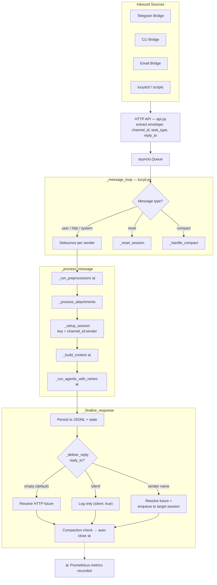
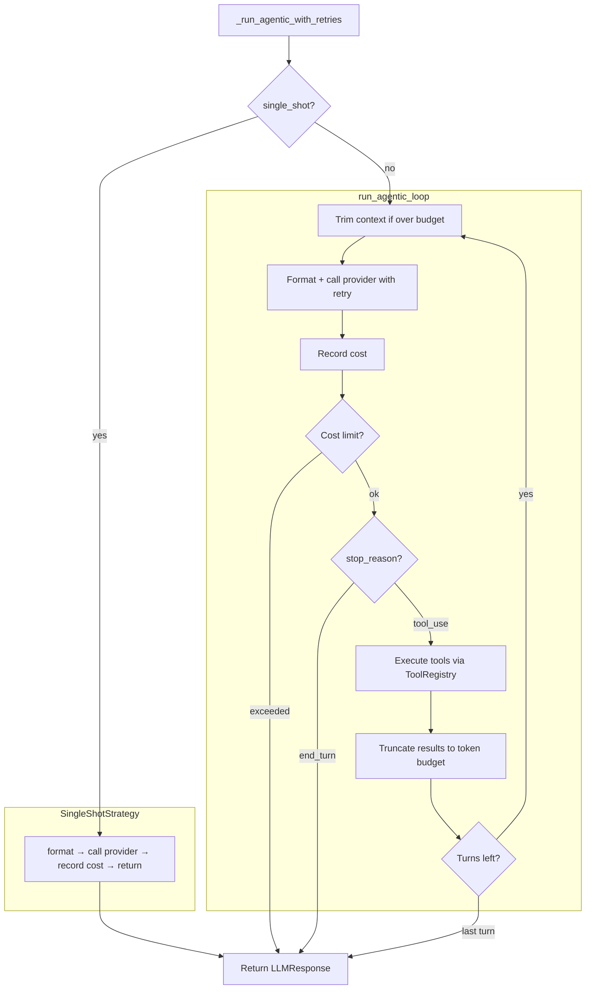
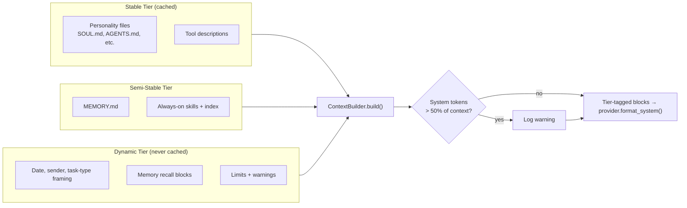
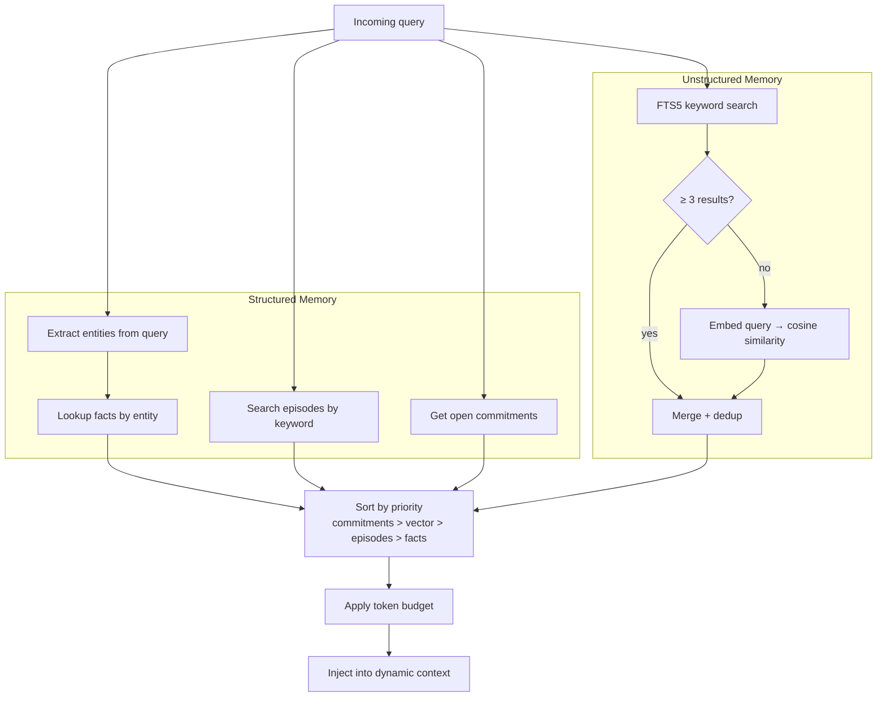
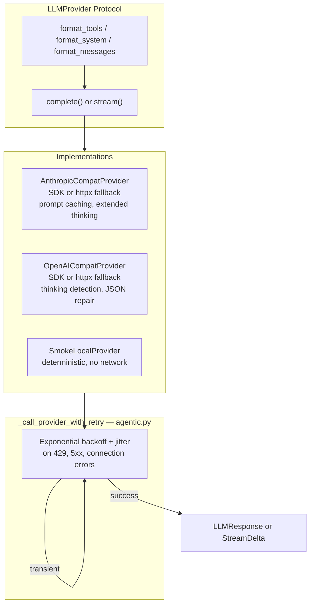
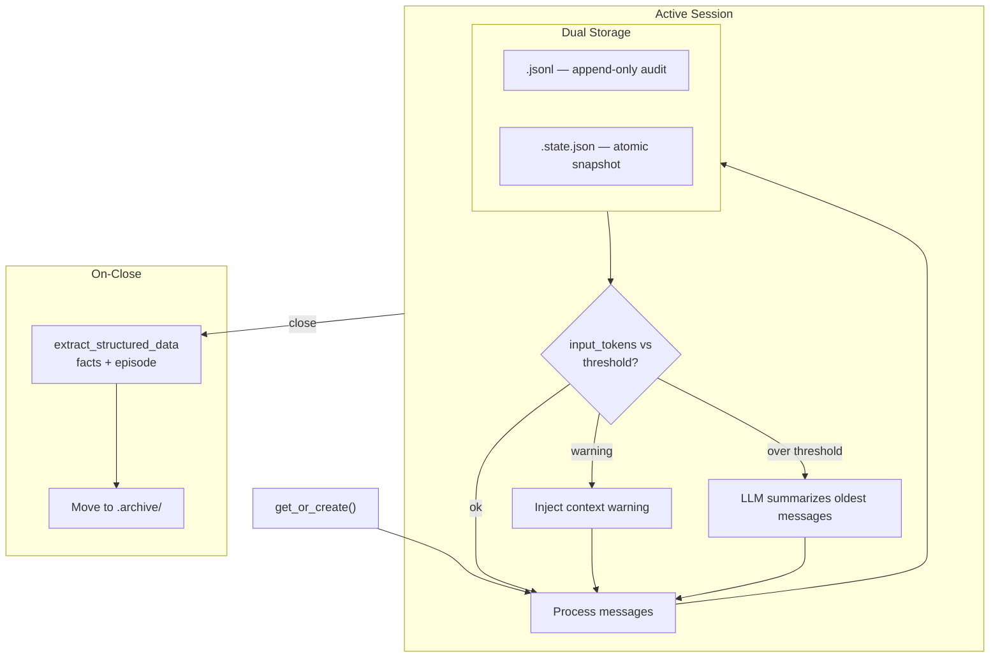
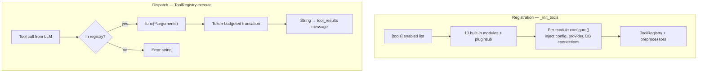
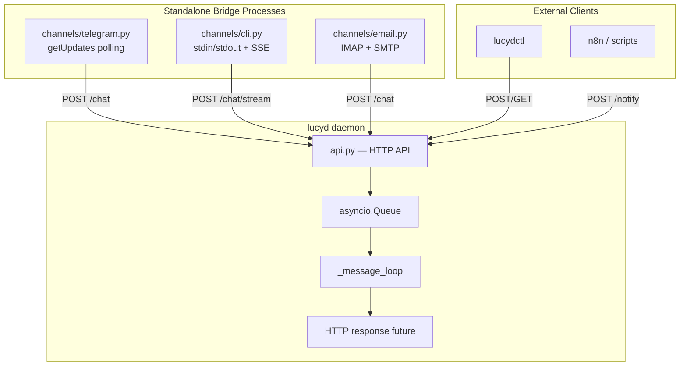
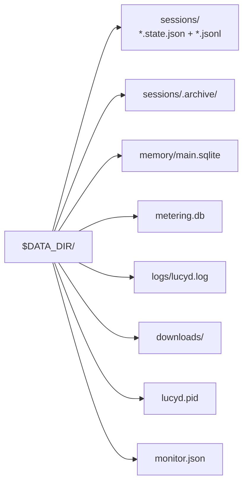
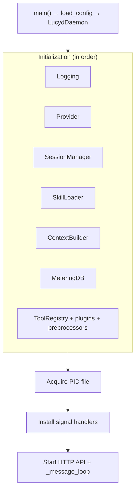

# Lucyd Architecture Diagrams

Visual reference for the Lucyd agent framework. Renders natively on GitHub and Gitea.

---

## 1. Message Lifecycle

How an inbound message flows from channel to response delivery.

```mermaid
flowchart TD
    subgraph Sources["Inbound Sources"]
        TG["Telegram Bridge"]
        CLI["CLI Bridge"]
        EMAIL["Email Bridge"]
        CTL["lucydctl / scripts"]
    end

    HTTP["HTTP API — api.py<br/>extract envelope: channel_id, task_type, reply_to"]
    Q["asyncio.Queue"]

    subgraph Loop["_message_loop — lucyd.py"]
        TYPE{"Message type?"}
        DEB["Debounce per sender"]
        RESET["_reset_session"]
        COMPACT["_handle_compact"]
    end

    subgraph Process["_process_message"]
        PREPROC["_run_preprocessors 📊"]
        ATTACH["_process_attachments"]
        SETUP["_setup_session<br/>key = channel_id:sender"]
        BUILD["_build_context 📊"]
        RUN["_run_agentic_with_retries 📊"]
    end

    subgraph Finalize["_finalize_response"]
        PERSIST["Persist to JSONL + state"]
        DELIVER{"_deliver_reply<br/>reply_to?"}
        DEFAULT["Resolve HTTP future"]
        SILENT["Log only (silent: true)"]
        REDIRECT["Resolve future +<br/>enqueue to target session"]
        POST_HOOKS["Compaction check → auto-close 📊"]
    end

    METRICS["📊 Prometheus metrics recorded"]

    Sources --> HTTP --> Q --> TYPE
    TYPE -->|"user / http / system"| DEB
    TYPE -->|reset| RESET
    TYPE -->|compact| COMPACT

    DEB --> PREPROC --> ATTACH --> SETUP --> BUILD --> RUN
    RUN --> PERSIST --> DELIVER
    DELIVER -->|"empty (default)"| DEFAULT --> POST_HOOKS
    DELIVER -->|"'silent'"| SILENT --> POST_HOOKS
    DELIVER -->|"sender name"| REDIRECT --> POST_HOOKS
    POST_HOOKS -.-> METRICS
```

📊 = Prometheus metric observation point: preprocessor duration/count, context utilization, API latency/tokens/cost, message duration/count, session close, agentic turns.

---

## 2. Agentic Loop

The core thinking-acting cycle in `agentic.py`.

```mermaid
flowchart TD
    START["_run_agentic_with_retries"]
    DISPATCH{"single_shot?"}

    subgraph SingleShot["SingleShotStrategy"]
        SS["format → call provider → record cost → return"]
    end

    subgraph ToolUse["run_agentic_loop"]
        TRIM["Trim context if over budget"]
        CALL["Format + call provider with retry"]
        METER["Record cost"]
        COST_CHECK{"Cost limit?"}
        STOP{"stop_reason?"}
        TOOLS["Execute tools via ToolRegistry"]
        TRUNC["Truncate results to token budget"]
        TURNS{"Turns left?"}
    end

    RETURN["Return LLMResponse"]

    START --> DISPATCH
    DISPATCH -->|yes| SS --> RETURN
    DISPATCH -->|no| TRIM --> CALL --> METER --> COST_CHECK
    COST_CHECK -->|exceeded| RETURN
    COST_CHECK -->|ok| STOP
    STOP -->|end_turn| RETURN
    STOP -->|tool_use| TOOLS --> TRUNC --> TURNS
    TURNS -->|yes| TRIM
    TURNS -->|last turn| RETURN
```

---

## 3. Context Building

System prompt assembly with cache tiers. `context.py`.

```mermaid
flowchart LR
    subgraph Stable["Stable Tier (cached)"]
        PERSONA["Personality files<br/>SOUL.md, AGENTS.md, etc."]
        TOOL_DESC["Tool descriptions"]
    end

    subgraph Semi["Semi-Stable Tier"]
        MEMORY_MD["MEMORY.md"]
        SKILLS["Always-on skills + index"]
    end

    subgraph Dynamic["Dynamic Tier (never cached)"]
        RUNTIME["Date, sender, task-type framing"]
        RECALL["Memory recall blocks"]
        LIMITS["Limits + warnings"]
    end

    BUILD["ContextBuilder.build()"]
    CHECK{"System tokens<br/>> 50% of context?"}
    WARN["Log warning"]
    BLOCKS["Tier-tagged blocks → provider.format_system()"]

    Stable --> BUILD
    Semi --> BUILD
    Dynamic --> BUILD
    BUILD --> CHECK
    CHECK -->|no| BLOCKS
    CHECK -->|yes| WARN --> BLOCKS
```

---

## 4. Memory Recall

How relevant context is retrieved from the memory system. `memory.py`.

```mermaid
flowchart TD
    QUERY["Incoming query"]

    subgraph Structured["Structured Memory"]
        ENTITIES["Extract entities from query"]
        FACTS["Lookup facts by entity"]
        EPISODES["Search episodes by keyword"]
        COMMITMENTS["Get open commitments"]
    end

    subgraph Unstructured["Unstructured Memory"]
        FTS["FTS5 keyword search"]
        FTS_CHECK{"≥ 3 results?"}
        VECTOR["Embed query → cosine similarity"]
        MERGE["Merge + dedup"]
    end

    PRIORITY["Sort by priority<br/>commitments > vector > episodes > facts"]
    BUDGET["Apply token budget"]
    OUTPUT["Inject into dynamic context"]

    QUERY --> ENTITIES --> FACTS
    QUERY --> EPISODES
    QUERY --> COMMITMENTS
    QUERY --> FTS --> FTS_CHECK
    FTS_CHECK -->|yes| MERGE
    FTS_CHECK -->|no| VECTOR --> MERGE

    FACTS --> PRIORITY
    EPISODES --> PRIORITY
    COMMITMENTS --> PRIORITY
    MERGE --> PRIORITY
    PRIORITY --> BUDGET --> OUTPUT
```

---

## 5. Provider Abstraction

`providers/__init__.py` defines the `LLMProvider` protocol. Each provider translates between the neutral internal format and its API.

```mermaid
flowchart TD
    subgraph Protocol["LLMProvider Protocol"]
        direction LR
        FMT["format_tools / format_system / format_messages"]
        CALL["complete() or stream()"]
    end

    subgraph Providers["Implementations"]
        ANTHROPIC["AnthropicCompatProvider<br/>SDK or httpx fallback<br/>prompt caching, extended thinking"]
        OPENAI["OpenAICompatProvider<br/>SDK or httpx fallback<br/>thinking detection, JSON repair"]
        SMOKE["SmokeLocalProvider<br/>deterministic, no network"]
    end

    subgraph Retry["_call_provider_with_retry — agentic.py"]
        BACKOFF["Exponential backoff + jitter<br/>on 429, 5xx, connection errors"]
    end

    RESP["LLMResponse or StreamDelta"]

    FMT --> CALL
    CALL --> Providers
    Providers --> BACKOFF
    BACKOFF -->|transient| BACKOFF
    BACKOFF -->|success| RESP
```

---

## 6. Session Persistence

Dual storage with compaction and consolidation. `session.py`.

```mermaid
flowchart TD
    CREATE["get_or_create()"]

    subgraph Active["Active Session"]
        MSG["Process messages"]

        subgraph Storage["Dual Storage"]
            JSONL[".jsonl — append-only audit"]
            STATE[".state.json — atomic snapshot"]
        end

        CHECK{"input_tokens vs<br/>threshold?"}
        WARN["Inject context warning"]
        COMPACT["LLM summarizes oldest messages"]
    end

    subgraph Close["On-Close"]
        EXTRACT["extract_structured_data<br/>facts + episode"]
        ARCHIVE["Move to .archive/"]
    end

    CREATE --> MSG --> Storage --> CHECK
    CHECK -->|ok| MSG
    CHECK -->|warning| WARN --> MSG
    CHECK -->|over threshold| COMPACT --> MSG
    Active -->|close| EXTRACT --> ARCHIVE
```

---

## 7. Tool System

Registration at startup, dispatch at runtime. `tools/__init__.py`.

```mermaid
flowchart TD
    subgraph Startup["Registration — _init_tools"]
        CONFIG["[tools] enabled list"]
        MODULES["10 built-in modules + plugins.d/"]
        CONFIGURE["Per-module configure()<br/>inject config, provider, DB connections"]
        REG["ToolRegistry + preprocessors"]
        CONFIG --> MODULES --> CONFIGURE --> REG
    end

    subgraph Runtime["Dispatch — ToolRegistry.execute"]
        CALL["Tool call from LLM"]
        LOOKUP{"In registry?"}
        EXEC["func(**arguments)"]
        TRUNC["Token-budgeted truncation"]
        RESULT["String → tool_results message"]
        ERR["Error string"]
    end

    CALL --> LOOKUP
    LOOKUP -->|yes| EXEC --> TRUNC --> RESULT
    LOOKUP -->|no| ERR
```

**Registered Tools (14):**

| Tool | Module | Async | Security |
|------|--------|-------|----------|
| `exec` | shell.py | yes | _safe_env, timeout, killpg |
| `web_search` | web.py | yes | API key gated |
| `web_fetch` | web.py | yes | SSRF: _is_private_ip, DNS pin, redirect validation |
| `read` | filesystem.py | no | _check_path allowlist |
| `write` | filesystem.py | no | _check_path allowlist |
| `edit` | filesystem.py | no | _check_path allowlist |
| `sessions_spawn` | agents.py | yes | deny-list, scoped tools, max_turns |
| `memory_search` | memory_read.py | yes | — |
| `memory_get` | memory_read.py | yes | — |
| `memory_write` | memory_write.py | no | — |
| `memory_forget` | memory_write.py | no | — |
| `commitment_update` | memory_write.py | no | — |
| `session_status` | status.py | no | — |
| `load_skill` | skills.py | no | — |

---

## 8. Architecture: HTTP Core + Bridge Pattern

HTTP API is the single boundary. Bridges are standalone processes.

```mermaid
flowchart TD
    subgraph Bridges["Standalone Bridge Processes"]
        TG["channels/telegram.py<br/>getUpdates polling"]
        CLI["channels/cli.py<br/>stdin/stdout + SSE"]
        EMAIL["channels/email.py<br/>IMAP + SMTP"]
    end

    subgraph Daemon["lucyd daemon"]
        API["api.py — HTTP API"]
        Q["asyncio.Queue"]
        LOOP["_message_loop"]
        FUTURE["HTTP response future"]
    end

    subgraph External["External Clients"]
        CTL["lucydctl"]
        N8N["n8n / scripts"]
    end

    TG -->|"POST /chat"| API
    CLI -->|"POST /chat/stream"| API
    EMAIL -->|"POST /chat"| API
    CTL -->|"POST/GET"| API
    N8N -->|"POST /notify"| API

    API --> Q --> LOOP
    LOOP --> FUTURE
```

---

## 9. Data Directory Layout

All persistent state derives from `$DATA_DIR`.

```mermaid
flowchart LR
    ROOT["$DATA_DIR/"]
    SESSIONS["sessions/<br/>*.state.json + *.jsonl"]
    ARCHIVE["sessions/.archive/"]
    MEMDB["memory/main.sqlite"]
    METERING["metering.db"]
    LOGS["logs/lucyd.log"]
    DOWNLOADS["downloads/"]
    PID["lucyd.pid"]
    MONITOR["monitor.json"]

    ROOT --> SESSIONS
    ROOT --> ARCHIVE
    ROOT --> MEMDB
    ROOT --> METERING
    ROOT --> LOGS
    ROOT --> DOWNLOADS
    ROOT --> PID
    ROOT --> MONITOR
```

---

## 10. Startup Sequence

Initialization order in `LucydDaemon.run()`.

```mermaid
flowchart TD
    MAIN["main() → load_config → LucydDaemon"]

    subgraph Init["Initialization (in order)"]
        LOG["Logging"]
        PROVIDER["Provider"]
        SESSION["SessionManager"]
        SKILLS["SkillLoader"]
        CONTEXT["ContextBuilder"]
        METER["MeteringDB"]
        TOOLS["ToolRegistry + plugins + preprocessors"]
    end

    PID["Acquire PID file"]
    SIGNALS["Install signal handlers"]
    RUN["Start HTTP API + _message_loop"]

    MAIN --> Init
    Init --> PID --> SIGNALS --> RUN
```
