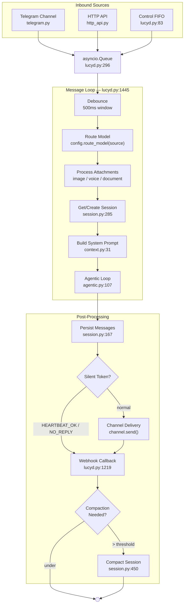
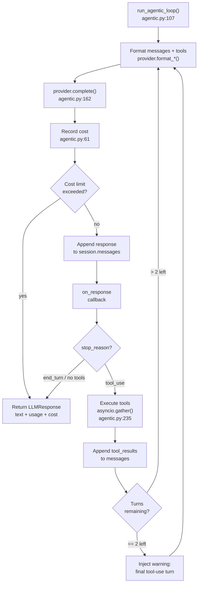
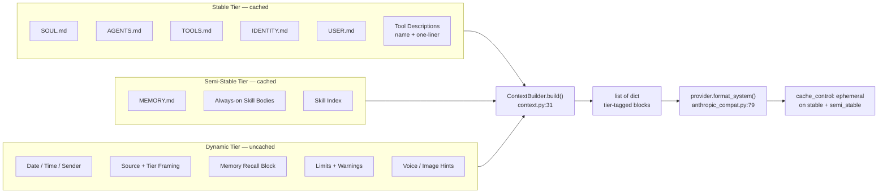
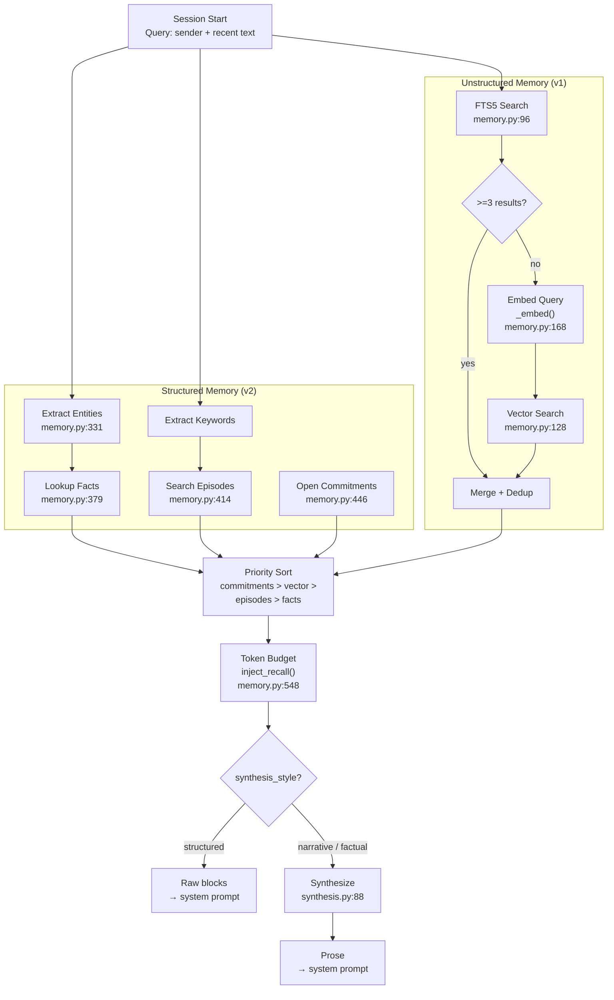
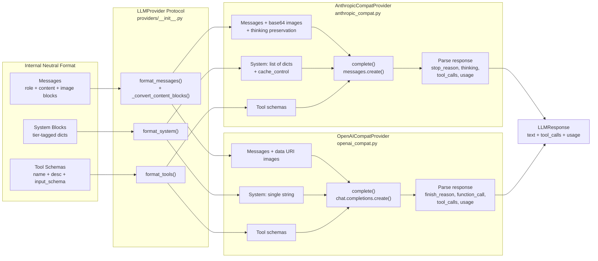
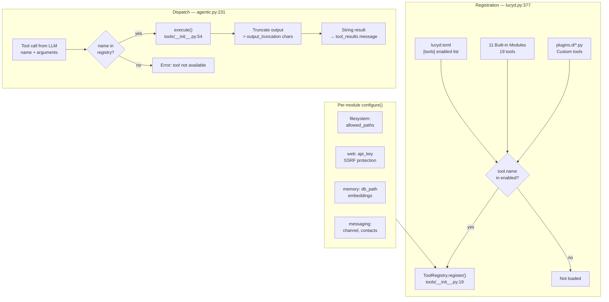
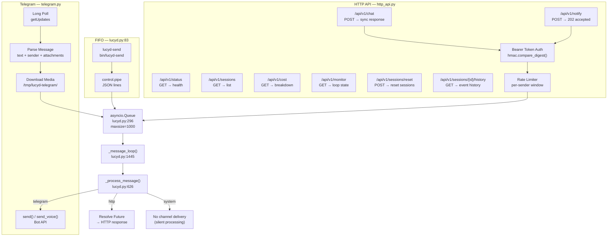

# Lucyd Architecture Diagrams

Visual reference for the Lucyd agent framework. Each diagram references real function names and file paths. Renders natively on GitHub and Gitea.

---

## 1. Message Lifecycle

How an inbound message flows from channel to response delivery.

---

## 2. Agentic Loop

The core thinking-acting cycle that processes each message.

---

## 3. Context Building

How the system prompt is assembled from workspace files with cache tiers.

---

## 4. Memory Recall

How relevant context is retrieved from the memory system at session start.

---

## 5. Provider Abstraction

How internal neutral format translates to provider-specific API calls.

---

## 6. Session Persistence

Dual storage model with compaction lifecycle.

---

## 7. Tool System

Registration at startup, dispatch at runtime.

---

## 8. Channels and HTTP API

Parallel transports feeding one processing queue.

